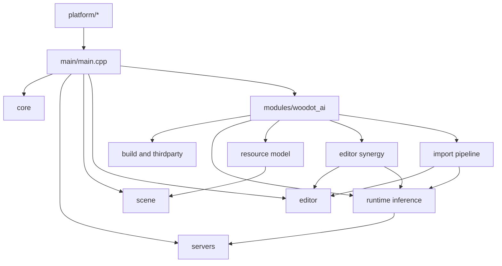
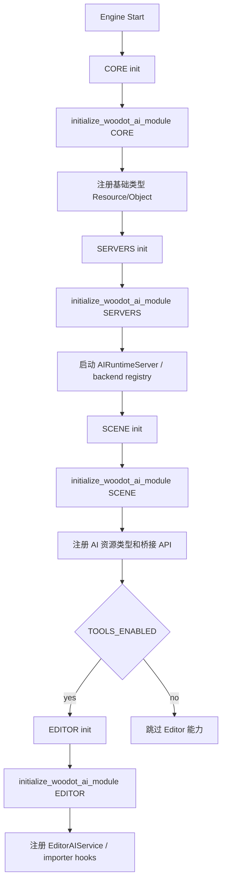
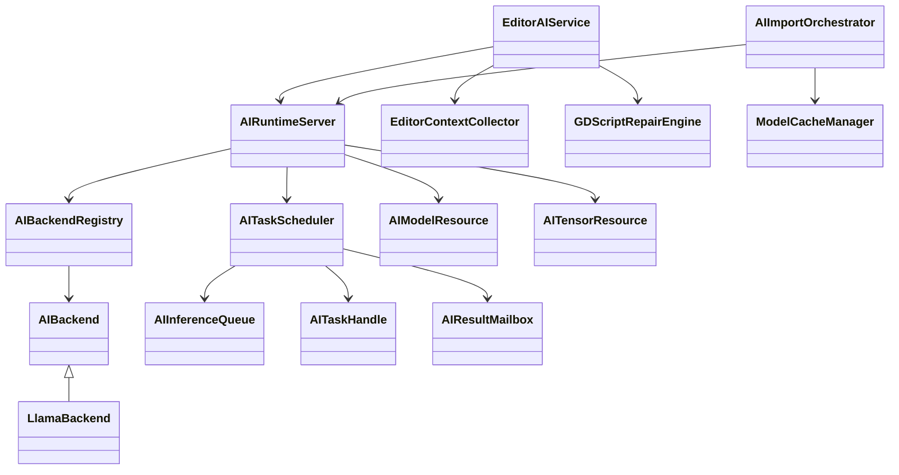
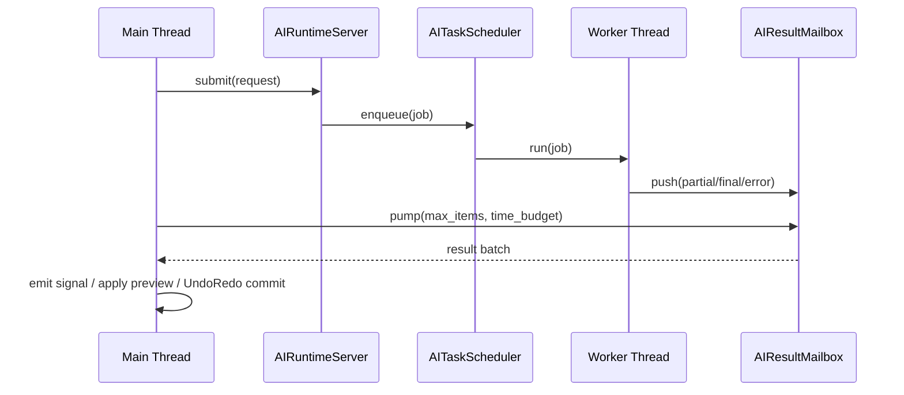
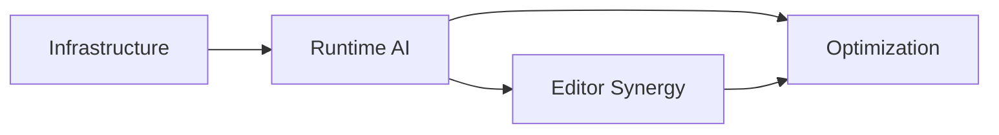

# Woodot AI System Overview

## 1. 文档目标

本文件描述 `Woodot` AI 子系统的全局架构、模块分层、生命周期、线程边界、数据流和防御性设计原则。

它回答 5 个核心问题：

1. AI 模块放在哪里
2. AI 如何接入 Godot 初始化阶段
3. AI 推理如何不阻塞主循环
4. AI 结果如何安全回写编辑器和场景
5. AI 能力如何为未来多后端与生态扩展留接口

---

## 2. 全局分层图



设计意图：

- AI 核心能力优先放在 `modules/woodot_ai`
- 如果未来运行时规模继续扩大，再考虑把 `runtime inference` 部分上提到 `servers/ai`
- 第一阶段不主动侵入 `main/main.cpp` 主流程，优先复用模块初始化机制

---

## 3. 模块责任矩阵

| 模块 | 主要职责 | 只读依赖 | 写入边界 | 高风险点 |
|---|---|---|---|---|
| Build & Dependencies | 编译开关、第三方引入、平台编译 | `SConstruct`, `SCsub`, platform scripts | `modules/woodot_ai` | Android NDK、ABI、裁剪开关失控 |
| Runtime Inference | 模型实例、后端抽象、异步调度、结果回传 | `core`, `os`, `object`, `threading` | `modules/woodot_ai/runtime` | 主线程阻塞、上下文争用、流式通知风暴 |
| Resource Model | 模型/张量/请求/执行计划资源化 | `scene/resources`, `core/io` | `modules/woodot_ai/resources` | Resource 与运行态实例耦合 |
| Editor Synergy | 上下文收集、脚本修复、节点树生成 | `editor`, `scene`, `gdscript` | `modules/woodot_ai/editor` | 自动改写场景、UndoRedo 不完整 |
| Import Pipeline & Ecosystem | 导入增强、缓存、导出元数据、插件 API | `editor/import`, `editor/export` | `modules/woodot_ai/import` | 导入过慢、平台兼容性、API 不稳定 |

---

## 4. 目录结构与初始化层级

### 4.1 建议目录树

```text
modules/woodot_ai/
├─ SCsub
├─ config.py
├─ register_types.h
├─ register_types.cpp
├─ thirdparty/
│  └─ llama.cpp/
├─ backends/
│  ├─ ai_backend.h
│  ├─ ai_backend_registry.h
│  ├─ llama/
│  ├─ vulkan/
│  ├─ cuda/
│  └─ metal/
├─ runtime/
│  ├─ ai_runtime_server.h
│  ├─ ai_task_scheduler.h
│  ├─ ai_inference_queue.h
│  ├─ ai_task_handle.h
│  ├─ ai_result_mailbox.h
│  ├─ ai_metrics.h
│  ├─ ai_log.h
│  └─ platform/
│     ├─ android/
│     └─ desktop/
├─ resources/
│  ├─ ai_model_resource.h
│  ├─ ai_tensor_resource.h
│  ├─ ai_prompt_template.h
│  └─ ai_execution_plan.h
├─ editor/
│  ├─ editor_ai_service.h
│  ├─ editor_context_collector.h
│  ├─ gdscript_repair_engine.h
│  └─ editor_ai_preview_diff.h
└─ import/
   ├─ ai_import_orchestrator.h
   ├─ ai_asset_annotator.h
   └─ ai_import_cache.h
```

目录约束：

- `thirdparty/` 只放第三方源码和必要补丁，不放对外公开头文件
- `backends/` 只处理推理后端和设备能力，不直接依赖编辑器代码
- `runtime/` 负责任务调度、结果回传、监控与平台适配
- `resources/` 只定义可序列化资源，不持有重量级运行态上下文
- `editor/` 只在 `EDITOR` 初始化层级注册，不反向控制运行时调度细节
- `import/` 只通过导入器和缓存编排接入，不越层直接修改场景树

### 4.2 初始化层级分配

| 初始化层级 | 注册内容 | 禁止内容 | 设计原因 |
|---|---|---|---|
| `CORE` | 日志分类、轻量枚举、基础 `Object`/`Resource` 类型声明、配置键 | 模型加载、线程启动、设备探测 | 保持最小副作用，避免拉长引擎早期启动 |
| `SERVERS` | `AIRuntimeServer`、`AIBackendRegistry`、`AITaskScheduler`、metrics 管道 | 编辑器 UI、导入器、场景节点操作 | 推理系统本质上是运行时服务域 |
| `SCENE` | `AIModelResource`、`AITensorResource`、场景桥接 API | 编辑器专属面板、扫描器、重型导入逻辑 | 资源与运行时桥接在这里最自然 |
| `EDITOR` | `EditorAIService`、上下文收集器、diff/预览、导入器钩子 | 直接接管 runtime 核心调度、主线程长阻塞模型初始化 | 工具链只消费运行时能力，不反客为主 |

### 4.3 初始化 ownership

- `register_types.cpp` 是唯一初始化入口，负责按 `ModuleInitializationLevel` 分发
- `AIRuntimeServer` 的创建、挂载和销毁只属于 `SERVERS`
- `Resource` 类型注册只在 `SCENE` 做，避免 `CORE` 过早依赖场景层
- 编辑器能力必须通过 `#ifdef TOOLS_ENABLED` 或 `EDITOR` 层级隔离
- 后端探测可以在 `SERVERS` 做轻量 capability probe，但真实模型初始化必须延后到首次使用或显式 preload

---

## 5. 生命周期接入图



关键约束：

- `CORE` 阶段只注册轻量类型，不做重量级模型加载
- `SERVERS` 阶段建立 AI 运行时单例
- `SCENE` 阶段注册资源和场景侧桥接
- `EDITOR` 阶段只在工具构建开启时启用编辑器协同

---

## 6. 边界说明

### 6.1 与 `core` 的边界

AI 模块可以依赖：

- `Object` / `RefCounted` / `ClassDB` / `Variant`
- `Mutex` / `RWLock` / `Semaphore` / `Thread`
- `WorkerThreadPool` 的轻量辅助能力
- `OS`、时间、日志、文件与路径工具

AI 模块不应把以下能力做进 `core`：

- 模型加载器和推理后端
- AI 任务调度策略
- AI 专用 metrics/日志面板语义
- 面向编辑器的上下文收集或补丁逻辑

边界原则：

- `core` 只提供基础设施，`woodot_ai` 只消费，不回写通用 AI 语义到 `core`
- 若未来多个模块共享 AI 基础设施，再评估是否上提通用抽象

### 6.2 与 `servers` 的边界

`AIRuntimeServer` 归属 `modules/woodot_ai/runtime`，但其职责形态参考 `servers`。

允许：

- 暴露统一的异步提交、取消、查询、能力探测接口
- 维护模型缓存、队列、后端注册表、结果邮箱
- 提供脚本和编辑器都可复用的运行时服务入口

禁止：

- 侵入现有 `RenderingServer`、`AudioServer`、`PhysicsServer` 生命周期
- 假定渲染线程模型能直接复用为推理线程模型
- 把 AI 调度塞进已有 server 的 update loop

边界原则：

- AI 是“并列运行时服务”，不是对现有 server 的补丁层

### 6.3 与 `scene` 的边界

`scene` 层只承接 AI 的资源化表达和主线程安全桥接。

允许：

- 注册 `AIModelResource`、`AITensorResource`、提示模板等资源
- 提供少量用户可见的桥接对象，例如任务句柄、结果快照
- 在主线程安全点把结果应用到资源或场景计划

禁止：

- 在 `scene` 中维护真实模型上下文或设备内存
- 让 `Node` 直接持有后端裸指针
- 绕过主线程约束，让工作线程直接操作 `Node` / `SceneTree`

边界原则：

- `scene` 负责表达，不负责执行

### 6.4 与 `editor` 的边界

编辑器层是 AI 能力的消费者，而不是推理核心的宿主。

允许：

- 做上下文收集、预算控制、diff 预览、UndoRedo 集成
- 通过 `EditorPlugin` / importer hooks 接入工作流
- 将自然语言或诊断结果转换为结构化计划后再调用 runtime

禁止：

- 直接 new/管理后端对象和调度线程
- 让模型输出直接执行编辑器命令
- 跳过预览和撤销系统直接写项目文件

边界原则：

- 编辑器负责“人机协作闭环”，运行时负责“推理与调度”

---

## 7. 逻辑组件图



---

## 8. 线程与回写边界


绝对规则：

1. 工作线程只负责计算，不直接操作 `Node`、`SceneTree`、`Control`、`EditorNode`
2. 结果必须通过 `AIResultMailbox` 或主线程消息投递回收
3. 编辑器自动修改必须统一进入 `UndoRedo`
4. 运行态对象和资源对象禁止跨线程共享可变状态

### 8.1 回写协议



协议定义：

1. `submit()` 只创建不可变请求快照，不把主线程对象引用传给工作线程
2. 工作线程只产出 `AIResultEnvelope`
3. `AIResultEnvelope` 至少包含 `task_id`、`event_type`、`payload`、`error_code`、`metrics_snapshot`
4. 主线程通过 `pump()` 批量取回结果，单帧受 `max_items` 和 `time_budget` 双限制
5. `partial` 结果只允许更新临时 UI 或预览缓冲，不允许直接提交最终资源/场景改动
6. `final` 结果才能进入资源更新、场景计划应用或编辑器确认流
7. `error` 和 `cancelled` 必须与正常结果走同一回收通道，避免状态分叉

### 8.2 线程角色

| 线程角色 | 允许操作 | 禁止操作 |
|---|---|---|
| 主线程 | 创建请求、轮询结果、发信号、更新 Inspector、执行 `UndoRedo` | 长时间 decode、阻塞式模型加载 |
| AI Worker | token decode、embedding、后端推理、采样、统计采集 | `Node` 改写、`SceneTree` 操作、编辑器 UI 更新 |
| IO / preload worker | 模型文件预读取、缓存校验、元数据扫描 | 主线程对象写回、直接触发编辑器动作 |

### 8.3 flush 策略

- token 流式输出按批量或时间片 flush，默认不做 per-token 主线程事件
- 每帧主线程回收预算建议先控制在 `1~2 ms`
- 结果队列满时优先合并 `partial` 事件，不丢 `final/error/cancelled`
- 编辑器态预览刷新频率要低于实际 decode 频率，避免 UI 抖动

---

## 9. metrics 与日志分类

### 9.1 统一 metrics 字段表

| 字段 | 类型 | 说明 | 采集点 |
|---|---|---|---|
| `task_id` | `uint64` | 任务唯一标识 | submit |
| `request_kind` | `enum` | completion / embedding / rerank / repair / import | submit |
| `caller_domain` | `enum` | runtime / editor / import / test | submit |
| `backend` | `enum` | llama_cpu / llama_vulkan / llama_cuda / llama_metal | backend create |
| `model_id` | `string` | 逻辑模型标识 | load / run |
| `model_path_hash` | `string` | 模型路径哈希，避免直接暴露绝对路径 | load |
| `queue_name` | `string` | 队列或设备域名称 | enqueue |
| `queue_wait_ms` | `double` | 排队等待时间 | dequeue |
| `prefill_ms` | `double` | prefill 耗时 | worker |
| `decode_ms` | `double` | decode 总耗时 | worker |
| `first_token_ms` | `double` | 首 token 延迟 | worker |
| `tokens_input` | `int` | 输入 token 数 | submit / tokenize |
| `tokens_output` | `int` | 输出 token 数 | final |
| `tokens_per_sec` | `double` | 推理吞吐 | final |
| `memory_cpu_mb` | `double` | CPU 内存占用快照 | load / run |
| `memory_gpu_mb` | `double` | GPU 显存占用快照 | load / run |
| `result_status` | `enum` | completed / failed / cancelled / timeout | finalize |
| `error_code` | `string` | 统一错误码 | error |
| `main_thread_flush_ms` | `double` | 单次主线程回收耗时 | pump |

字段原则：

- 优先采集稳定、低成本、可聚合字段
- 不默认记录原始 prompt、原始输出和绝对路径
- 用户内容如需采样，必须经过脱敏和显式调试开关

### 9.2 日志分类

| 分类 | 用途 | 示例 |
|---|---|---|
| `woodot_ai.build` | 构建期启停、feature flags、后端裁剪 | backend disabled on android |
| `woodot_ai.runtime` | runtime 生命周期、模型加载、任务调度 | model loaded, queue stalled |
| `woodot_ai.backend` | 第三方后端适配、设备探测、fallback | vulkan unavailable, fallback cpu |
| `woodot_ai.threading` | 线程、mailbox、flush、拥塞 | mailbox backlog merged |
| `woodot_ai.editor` | 上下文收集、diff、UndoRedo、预览确认 | repair preview created |
| `woodot_ai.import` | 导入器、缓存、sidecar、批处理 | asset annotate cache hit |
| `woodot_ai.metrics` | 周期性统计、profiling 快照 | task latency p95 |
| `woodot_ai.error` | 统一错误出口 | task failed with model_missing |

日志等级建议：

- `TRACE` 只用于局部开发和重型调试
- `INFO` 用于关键生命周期事件
- `WARN` 用于回退、拥塞、能力降级
- `ERROR` 用于任务失败、模型不可用、协议破坏

---

## 10. 关键防御策略

### 10.1 主线程防御

- 所有模型加载默认异步
- 首次使用时若必须同步初始化，必须提供显式 loading 状态
- 流式 token 更新做批量 flush，而不是每 token 发一次 UI 通知

### 10.2 资源防御

- `AIModelResource` 只描述配置，不持有真实推理上下文
- `AITensorResource` 只暴露受控访问接口
- 设备内存和 CPU 内存分开标记，禁止隐式拷贝

### 10.3 编辑器防御

- 自然语言输入必须先落结构化 IR
- 所有自动改动都要支持 diff 预览和撤销
- 自动修复默认建议态，不默认直接落地

### 10.4 平台防御

- 后端能力通过 feature flags 显式声明
- Android 单独维护 ABI 清单和最小可用配置
- 无 GPU 后端时必须稳定回退到 CPU

---

## 11. 阶段间依赖图



解读：

- `Phase 3` 必须建立在 `Phase 2` 的稳定调度与结果回写之上
- `Phase 4` 的 Importer 和生态 API 只有在运行时抽象稳定后才值得公开

---

## 12. 阶段验收 checklist

### 12.1 SYS 阶段验收项

| 项目 | 验收问题 | 通过标准 |
|---|---|---|
| 模块目录 | 目录是否按 `backends/runtime/resources/editor/import` 分层 | 无跨层混放的核心头/源文件 |
| 初始化层级 | 是否只有 `register_types.cpp` 负责分层注册 | 无多入口隐式初始化 |
| 边界控制 | 是否明确 `core/servers/scene/editor` 各自可写边界 | 设计文档与代码目录一致 |
| 线程协议 | 是否存在统一 mailbox 回写通道 | 无工作线程直接修改场景或编辑器对象 |
| metrics | 是否定义了统一 task/queue/model/error 字段 | 日志与统计字段名一致 |
| 回退策略 | CPU fallback、cancel、timeout 是否有统一出口 | 失败可观测且不会卡死主线程 |
| 编辑器安全 | 是否强制预览、确认、UndoRedo | 无直接落盘自动改写 |

### 12.2 进入实现阶段前必须回答的问题

1. `AIRuntimeServer` 是否已经明确归属 `SERVERS`，而不是挂到编辑器模块里？
2. 模型资源对象是否只描述配置，而不持有真实推理上下文？
3. 是否已经定义工作线程到主线程的唯一回收通道？
4. metrics 和日志字段是否足以定位“卡在哪个阶段”？
5. Android / 桌面 / GPU fallback 是否都在构建与运行时上有明确退路？

---

## 13. 开发工作清单任务表

| 编号 | 模块 | 任务 | 输出物 | 前置条件 | 风险等级 |
|---|---|---|---|---|---|
| SYS-001 | System | 确定 `modules/woodot_ai` 目录与初始化层级 | 目录结构文档 | 无 | 中 |
| SYS-002 | System | 明确 AI 模块与 `core/servers/scene/editor` 边界 | 边界说明 | SYS-001 | 高 |
| SYS-003 | System | 设计主线程/工作线程回写协议 | 线程模型说明 | SYS-002 | 高 |
| SYS-004 | System | 定义统一 metrics 字段和日志分类 | 监控字段表 | SYS-002 | 中 |
| SYS-005 | System | 建立阶段验收 checklist | 验收文档 | SYS-001 | 中 |

---

## 14. 建议的评审清单

每次设计评审至少检查以下问题：

1. 新增对象是否破坏了模块边界
2. 是否有工作线程直接修改 Godot 对象
3. 是否引入了无法跨平台构建的依赖
4. 是否把 `llama.cpp` 细节泄漏到了公开脚本 API
5. 是否提供了故障回退和取消机制
