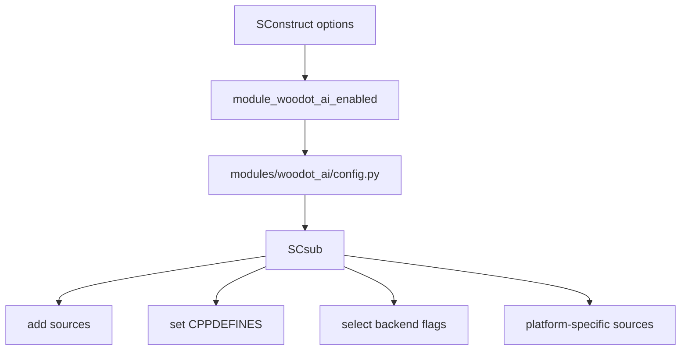
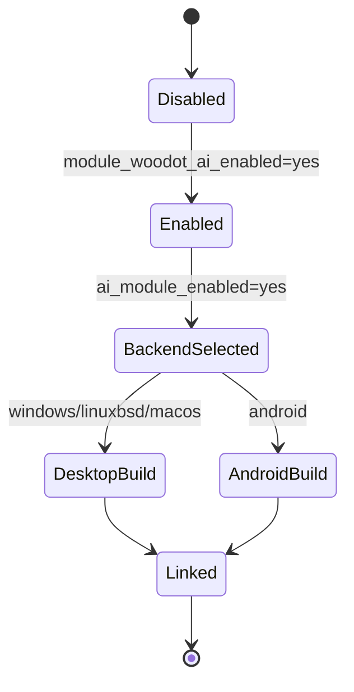
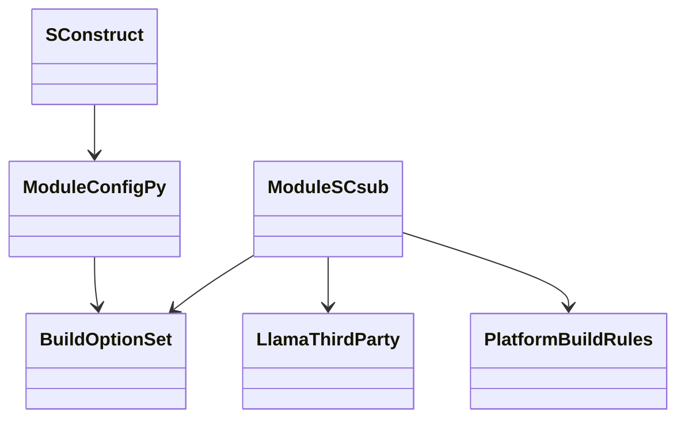
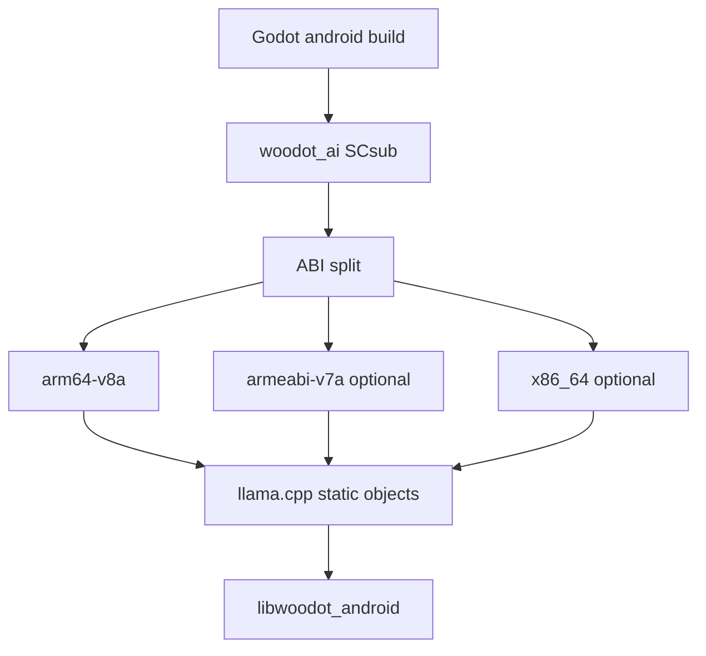
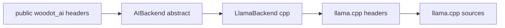

# Woodot AI Build And Dependencies

## 1. 模块目标

本模块负责解决以下问题：

1. `woodot_ai` 如何被 Godot 构建系统启停
2. `llama.cpp` 如何被隔离在模块内部
3. 不同平台如何统一编译参数
4. Android `NDK` 交叉编译如何提前收敛
5. 如何避免第三方依赖污染引擎全局构建

---

## 2. 模块目录建议

```text
modules/woodot_ai/
├─ SCsub
├─ config.py
├─ register_types.h
├─ register_types.cpp
├─ thirdparty/
│  └─ llama.cpp/
├─ backends/
├─ runtime/
├─ resources/
├─ editor/
└─ import/
```

设计原则：

- 所有 AI 第三方依赖优先收敛在模块内部
- 顶层 `thirdparty/` 不作为第一选择，除非后续多个模块共享同一 AI 库
- 平台裁剪、宏定义、源文件列表优先在 `SCsub` 与 `config.py` 内收口

---

## 3. 构建开关架构图



建议开关：

- `module_woodot_ai_enabled=yes/no`
- `ai_module_enabled=yes/no`
- `woodot_ai_cpu_enabled=yes/no`
- `woodot_ai_llama_enabled=yes/no`
- `woodot_ai_desktop_enabled=yes/no`
- `woodot_ai_windows_enabled=yes/no`
- `woodot_ai_linuxbsd_enabled=yes/no`
- `woodot_ai_macos_enabled=yes/no`
- `woodot_ai_vulkan_enabled=yes/no`
- `woodot_ai_cuda_enabled=yes/no`
- `woodot_ai_metal_enabled=yes/no`
- `woodot_ai_android_enabled=yes/no`

说明：

- `module_woodot_ai_enabled` 与 Godot 模块体系保持一致
- `ai_module_enabled` 作为模块内部总开关，便于快速裁剪和试验
- `woodot_ai_cpu_enabled` 是 CPU backend 总开关，首版 `llama.cpp` 依赖它
- 平台子开关只控制当前目标平台的源是否参与编译，不越权影响其他平台
- 后端开关必须是子开关，不能反过来绕过模块总开关

---

## 4. 构建状态机



---

## 5. 类与脚本关系图



---

## 6. `SCsub` 设计建议

### 6.1 总开关逻辑

必须有显式的：

```python
if not env["ai_module_enabled"]:
    Return()
```

防御理由：

- 避免某个后端子开关误触发构建
- 避免 CI、模板构建、移动端裁剪时无法彻底关闭 AI 模块

### 6.2 源文件组织策略

- 公共源文件和后端源文件分离
- 后端相关 `.cpp` 只在对应 feature flag 打开时编译
- Android 特定适配文件单独列清单，不混在桌面构建列表里
- `llama.cpp` thirdparty 源与 `woodot_ai` 自有源分两个 object 集合管理

### 6.3 桌面端平台源清单

| 分类 | Windows | Linux | macOS |
|---|---|---|---|
| 模块公共源 | `*.cpp` `runtime/*.cpp` `resources/*.cpp` `import/*.cpp` | 同左 | 同左 |
| 桌面平台源 | `runtime/platform/desktop/*.cpp` `runtime/platform/desktop/windows/*.cpp` | `runtime/platform/desktop/*.cpp` `runtime/platform/desktop/linuxbsd/*.cpp` | `runtime/platform/desktop/*.cpp` `runtime/platform/desktop/macos/*.cpp` |
| llama backend glue | `backends/*.cpp` `backends/llama/*.cpp` `backends/llama/platform/common/*.cpp` `backends/llama/platform/desktop/windows/*.cpp` | `backends/*.cpp` `backends/llama/*.cpp` `backends/llama/platform/common/*.cpp` `backends/llama/platform/desktop/linuxbsd/*.cpp` | `backends/*.cpp` `backends/llama/*.cpp` `backends/llama/platform/common/*.cpp` `backends/llama/platform/desktop/macos/*.cpp` |
| llama core | `thirdparty/llama.cpp/src/*.cpp` `src/models/*.cpp` | 同左 | 同左 |
| ggml core | `ggml/src/ggml.c` `ggml.cpp` `ggml-alloc.c` `ggml-backend*.cpp` `ggml-opt.cpp` `ggml-threading.cpp` `gguf.cpp` | 同左 | 同左 |
| ggml cpu | `ggml/src/ggml-cpu/*.c` `*.cpp` + `arch/x86/*` | `ggml/src/ggml-cpu/*.c` `*.cpp` + `arch/x86/*` 或 `arch/arm/*` | `ggml/src/ggml-cpu/*.c` `*.cpp` + Intel `arch/x86/*` / Apple Silicon `arch/arm/*` |

桌面规则要点：

- 第一阶段统一走 CPU backend，保证 Windows / Linux / macOS 都有同一条最小可用链路
- macOS 可额外启用 `Accelerate` 优化，但不要求第一版就引入 Metal
- 第三方源使用单独 `env_thirdparty` / `disable_warnings()`，避免把上游告警污染到引擎模块代码
- 平台专属 glue 文件只放在 `runtime/platform/desktop/<platform>/` 和 `backends/llama/platform/desktop/<platform>/`

### 6.4 编译宏建议

- `WOODOT_AI_ENABLED`
- `WOODOT_AI_LLAMA_ENABLED`
- `WOODOT_AI_VULKAN_ENABLED`
- `WOODOT_AI_CUDA_ENABLED`
- `WOODOT_AI_METAL_ENABLED`
- `WOODOT_AI_ANDROID_ENABLED`

补充 thirdparty 宏：

- `GGML_USE_CPU`
- `GGML_USE_ACCELERATE` 仅 `macOS`

### 6.5 头文件暴露原则

- 对外头文件不直接包含 `llama.h`
- 第三方头文件尽量只在 `.cpp` 内引用
- 必要时使用 PIMPL 隔离第三方 ABI

---

## 7. Android NDK 架构图



建议：

- 第一阶段只承诺 `arm64-v8a`
- `armeabi-v7a` 与 `x86_64` 后续按需求开启
- 不要在 0 到 1 阶段同时追所有 ABI

### 7.1 Android 首版编译规则

首版规则：

- 只在 `platform=android arch=arm64` 时编译 `llama.cpp`
- `woodot_ai_android_enabled=yes` 只是 Android 总开关，不等于允许所有 ABI
- Android 首版只接 CPU backend，不接 `vulkan/cuda/metal`
- 统一复用 Godot Android toolchain，不单独引入外部 CMake/Ninja 构建
- Android 专属 glue 只允许放在 `runtime/platform/android/*.cpp` 与 `runtime/platform/android/arm64-v8a/*.cpp`

Android 源清单：

| 分类 | 首版源范围 |
|---|---|
| 模块公共源 | `*.cpp` `runtime/*.cpp` `resources/*.cpp` `import/*.cpp` |
| Android 平台源 | `runtime/platform/android/*.cpp` `runtime/platform/android/arm64-v8a/*.cpp` |
| llama backend glue | `backends/*.cpp` `backends/llama/*.cpp` `backends/llama/platform/common/*.cpp` `backends/llama/platform/android/*.cpp` `backends/llama/platform/android/arm64-v8a/*.cpp` |
| llama core | `thirdparty/llama.cpp/src/*.cpp` `src/models/*.cpp` |
| ggml core | `ggml/src/ggml.c` `ggml.cpp` `ggml-alloc.c` `ggml-backend*.cpp` `ggml-opt.cpp` `ggml-threading.cpp` `gguf.cpp` |
| ggml cpu | `ggml/src/ggml-cpu/*.c` `*.cpp` + `ggml-cpu/arch/arm/*` |

Android 回退策略：

- 若 `arch != arm64`，首版直接不编译 `llama` thirdparty 源
- 若后续要支持 `armeabi-v7a` / `x86_64`，必须新增独立 ABI 清单和验证项
- 若 Android GPU 路径未稳定，运行期一律回退 CPU，不暴露半成品 GPU feature

---

## 8. Android NDK 风险清单

| 风险 | 表现 | 原因 | 防御策略 |
|---|---|---|---|
| STL 冲突 | 链接失败 | 第三方编译配置与 Godot 不一致 | 统一走 Godot Android toolchain |
| ABI 不一致 | 安装后崩溃 | 目标 ABI 与打包 ABI 不匹配 | 明确 ABI 白名单 |
| 编译参数漂移 | 某平台可过某平台不过 | 独立脚本未收口 | 所有宏和选项收敛到 `SCsub/config.py` |
| 后端误启用 | Android 构建炸裂 | 桌面后端代码被带入 | 平台条件编译和源文件拆分 |
| 异常大的产物 | APK 体积暴涨 | 静态库、权重、调试符号未裁剪 | Release 下裁剪符号和禁用未用后端 |

---

## 9. 依赖隔离图



设计意图：

- 上层不感知 `llama.cpp` 直接接口
- 若后续替换推理后端，不影响脚本 API 和大多数运行时类

---

## 10. 失败回退策略

### 10.1 构建期回退

- 若 `llama.cpp` 不满足平台条件，则构建禁用对应 backend
- 若整个平台不满足 AI 模块条件，则 `ai_module_enabled=no`
- 构建失败不应污染非 AI 模块

### 10.2 运行期回退

- GPU 后端初始化失败时回退 CPU
- Android 缺少某能力时，返回 capability unavailable，而不是直接崩溃

---

## 11. 开发工作清单任务表

| 编号 | 任务 | 说明 | 输出物 | 风险等级 |
|---|---|---|---|---|
| BLD-001 | 建立 `modules/woodot_ai/SCsub` | 总开关与源文件组织 | 初版 `SCsub` | 高 |
| BLD-002 | 增加 `ai_module_enabled=yes/no` | 模块内总开关 | 构建选项 | 高 |
| BLD-003 | 增加 `config.py` | 构建参数注册 | 初版 `config.py` | 中 |
| BLD-004 | vendor `llama.cpp` | 收敛到模块 `thirdparty/` | 第三方目录 | 高 |
| BLD-005 | 建立桌面端编译规则 | Windows/Linux/macOS | 平台源清单 | 高 |
| BLD-006 | 建立 Android `NDK` 编译规则 | 先只保 `arm64-v8a` | Android 规则说明 | 高 |
| BLD-007 | 添加 feature flags | CPU/GPU/平台子开关 | 宏和脚本 | 中 |
| BLD-008 | 验证禁用路径 | `ai_module_enabled=no` 不应编译 AI 代码 | CI/本地验证 | 高 |
| BLD-009 | 验证最小桌面链接 | 无功能仅链接成功 | 构建日志 | 中 |
| BLD-010 | 验证最小 Android 链路 | 交叉编译成功 | Android 构建日志 | 高 |

---

## 12. 验收标准

1. `ai_module_enabled=no` 时，AI 模块完全不参与编译
2. `llama.cpp` 不泄漏到公共 API
3. 桌面平台最小构建可通过
4. Android `arm64-v8a` 最小交叉编译可通过
5. 新增开关不会破坏现有 Godot 模块构建流程
