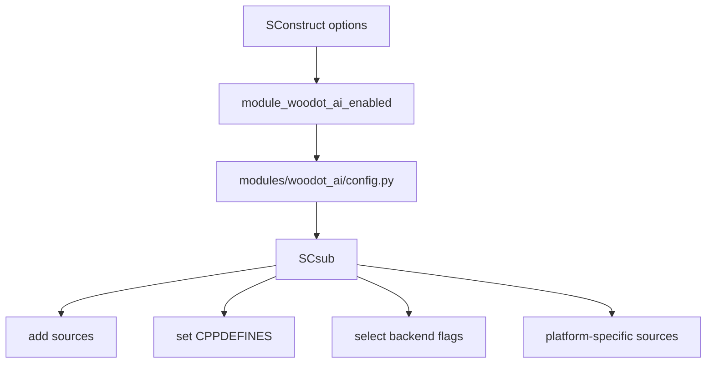
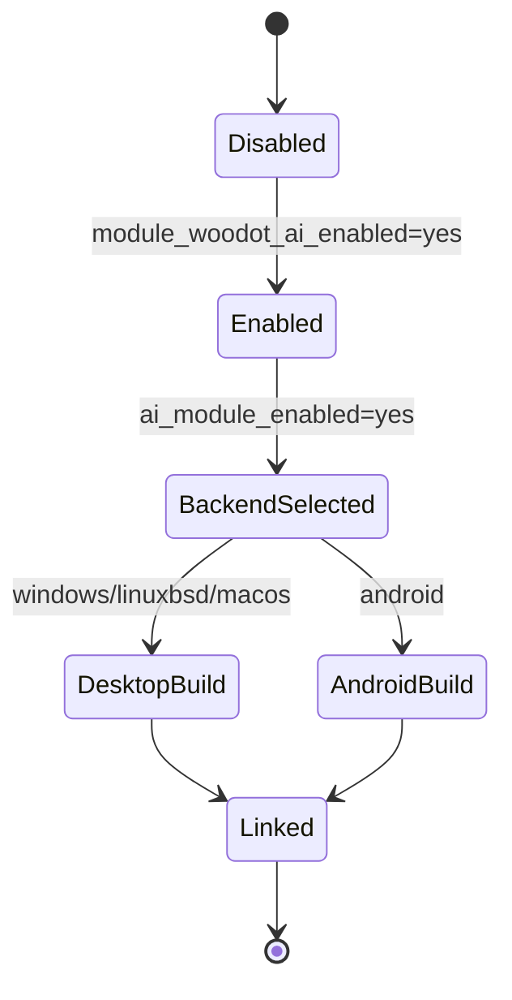
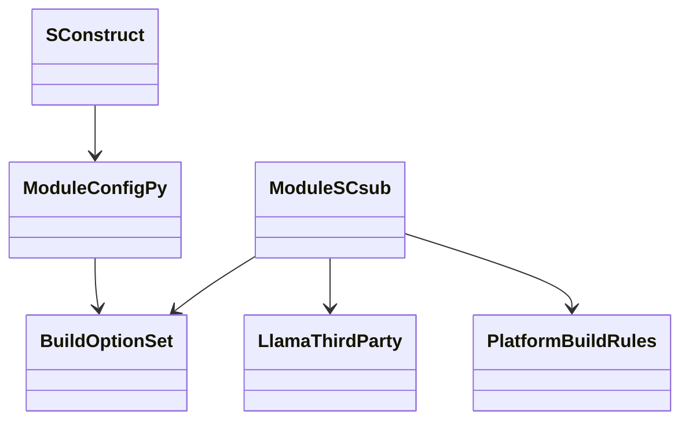
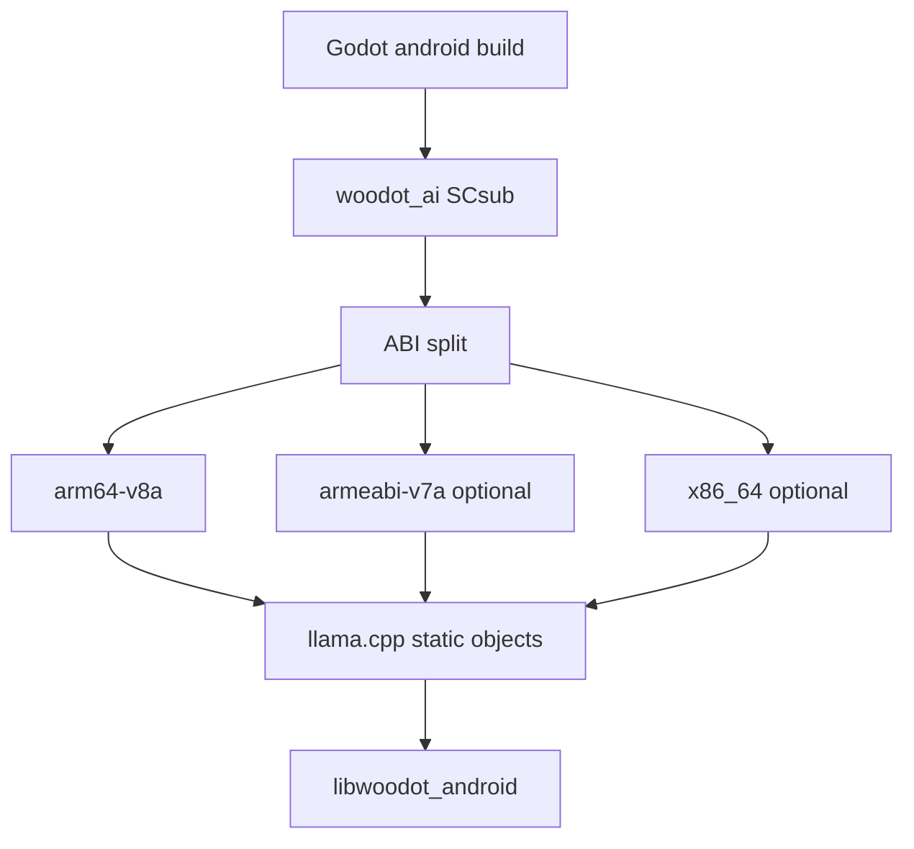
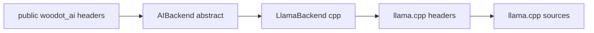

# Woodot AI Build And Dependencies

## 1. 模块目标

本模块负责解决以下问题：

1. `woodot_ai` 如何被 Godot 构建系统启停
2. `llama.cpp` 如何被隔离在模块内部
3. 不同平台如何统一编译参数
4. Android `NDK` 交叉编译如何提前收敛
5. 如何避免第三方依赖污染引擎全局构建

---

## 2. 模块目录建议

```text
modules/woodot_ai/
├─ SCsub
├─ config.py
├─ register_types.h
├─ register_types.cpp
├─ thirdparty/
│  └─ llama.cpp/
├─ backends/
├─ runtime/
├─ resources/
├─ editor/
└─ import/
```

设计原则：

- 所有 AI 第三方依赖优先收敛在模块内部
- 顶层 `thirdparty/` 不作为第一选择，除非后续多个模块共享同一 AI 库
- 平台裁剪、宏定义、源文件列表优先在 `SCsub` 与 `config.py` 内收口

---

## 3. 构建开关架构图



建议开关：

- `module_woodot_ai_enabled=yes/no`
- `ai_module_enabled=yes/no`
- `woodot_ai_cpu_enabled=yes/no`
- `woodot_ai_llama_enabled=yes/no`
- `woodot_ai_desktop_enabled=yes/no`
- `woodot_ai_windows_enabled=yes/no`
- `woodot_ai_linuxbsd_enabled=yes/no`
- `woodot_ai_macos_enabled=yes/no`
- `woodot_ai_vulkan_enabled=yes/no`
- `woodot_ai_cuda_enabled=yes/no`
- `woodot_ai_metal_enabled=yes/no`
- `woodot_ai_android_enabled=yes/no`

说明：

- `module_woodot_ai_enabled` 与 Godot 模块体系保持一致
- `ai_module_enabled` 作为模块内部总开关，便于快速裁剪和试验
- `woodot_ai_cpu_enabled` 是 CPU backend 总开关，首版 `llama.cpp` 依赖它
- 平台子开关只控制当前目标平台的源是否参与编译，不越权影响其他平台
- 后端开关必须是子开关，不能反过来绕过模块总开关

---

## 4. 构建状态机



---

## 5. 类与脚本关系图



---

## 6. `SCsub` 设计建议

### 6.1 总开关逻辑

必须有显式的：

```python
if not env["ai_module_enabled"]:
    Return()
```

防御理由：

- 避免某个后端子开关误触发构建
- 避免 CI、模板构建、移动端裁剪时无法彻底关闭 AI 模块

### 6.2 源文件组织策略

- 公共源文件和后端源文件分离
- 后端相关 `.cpp` 只在对应 feature flag 打开时编译
- Android 特定适配文件单独列清单，不混在桌面构建列表里
- `llama.cpp` thirdparty 源与 `woodot_ai` 自有源分两个 object 集合管理

### 6.3 桌面端平台源清单

| 分类 | Windows | Linux | macOS |
|---|---|---|---|
| 模块公共源 | `*.cpp` `runtime/*.cpp` `resources/*.cpp` `import/*.cpp` | 同左 | 同左 |
| 桌面平台源 | `runtime/platform/desktop/*.cpp` `runtime/platform/desktop/windows/*.cpp` | `runtime/platform/desktop/*.cpp` `runtime/platform/desktop/linuxbsd/*.cpp` | `runtime/platform/desktop/*.cpp` `runtime/platform/desktop/macos/*.cpp` |
| llama backend glue | `backends/*.cpp` `backends/llama/*.cpp` `backends/llama/platform/common/*.cpp` `backends/llama/platform/desktop/windows/*.cpp` | `backends/*.cpp` `backends/llama/*.cpp` `backends/llama/platform/common/*.cpp` `backends/llama/platform/desktop/linuxbsd/*.cpp` | `backends/*.cpp` `backends/llama/*.cpp` `backends/llama/platform/common/*.cpp` `backends/llama/platform/desktop/macos/*.cpp` |
| llama core | `thirdparty/llama.cpp/src/*.cpp` `src/models/*.cpp` | 同左 | 同左 |
| ggml core | `ggml/src/ggml.c` `ggml.cpp` `ggml-alloc.c` `ggml-backend*.cpp` `ggml-opt.cpp` `ggml-threading.cpp` `gguf.cpp` | 同左 | 同左 |
| ggml cpu | `ggml/src/ggml-cpu/*.c` `*.cpp` + `arch/x86/*` | `ggml/src/ggml-cpu/*.c` `*.cpp` + `arch/x86/*` 或 `arch/arm/*` | `ggml/src/ggml-cpu/*.c` `*.cpp` + Intel `arch/x86/*` / Apple Silicon `arch/arm/*` |

桌面规则要点：

- 第一阶段统一走 CPU backend，保证 Windows / Linux / macOS 都有同一条最小可用链路
- macOS 可额外启用 `Accelerate` 优化，但不要求第一版就引入 Metal
- 第三方源使用单独 `env_thirdparty` / `disable_warnings()`，避免把上游告警污染到引擎模块代码
- 平台专属 glue 文件只放在 `runtime/platform/desktop/<platform>/` 和 `backends/llama/platform/desktop/<platform>/`

### 6.4 编译宏建议

- `WOODOT_AI_ENABLED`
- `WOODOT_AI_LLAMA_ENABLED`
- `WOODOT_AI_VULKAN_ENABLED`
- `WOODOT_AI_CUDA_ENABLED`
- `WOODOT_AI_METAL_ENABLED`
- `WOODOT_AI_ANDROID_ENABLED`

补充 thirdparty 宏：

- `GGML_USE_CPU`
- `GGML_USE_ACCELERATE` 仅 `macOS`

### 6.5 头文件暴露原则

- 对外头文件不直接包含 `llama.h`
- 第三方头文件尽量只在 `.cpp` 内引用
- 必要时使用 PIMPL 隔离第三方 ABI

---

## 7. Android NDK 架构图



建议：

- 第一阶段只承诺 `arm64-v8a`
- `armeabi-v7a` 与 `x86_64` 后续按需求开启
- 不要在 0 到 1 阶段同时追所有 ABI

### 7.1 Android 首版编译规则

首版规则：

- 只在 `platform=android arch=arm64` 时编译 `llama.cpp`
- `woodot_ai_android_enabled=yes` 只是 Android 总开关，不等于允许所有 ABI
- Android 首版只接 CPU backend，不接 `vulkan/cuda/metal`
- 统一复用 Godot Android toolchain，不单独引入外部 CMake/Ninja 构建
- Android 专属 glue 只允许放在 `runtime/platform/android/*.cpp` 与 `runtime/platform/android/arm64-v8a/*.cpp`

Android 源清单：

| 分类 | 首版源范围 |
|---|---|
| 模块公共源 | `*.cpp` `runtime/*.cpp` `resources/*.cpp` `import/*.cpp` |
| Android 平台源 | `runtime/platform/android/*.cpp` `runtime/platform/android/arm64-v8a/*.cpp` |
| llama backend glue | `backends/*.cpp` `backends/llama/*.cpp` `backends/llama/platform/common/*.cpp` `backends/llama/platform/android/*.cpp` `backends/llama/platform/android/arm64-v8a/*.cpp` |
| llama core | `thirdparty/llama.cpp/src/*.cpp` `src/models/*.cpp` |
| ggml core | `ggml/src/ggml.c` `ggml.cpp` `ggml-alloc.c` `ggml-backend*.cpp` `ggml-opt.cpp` `ggml-threading.cpp` `gguf.cpp` |
| ggml cpu | `ggml/src/ggml-cpu/*.c` `*.cpp` + `ggml-cpu/arch/arm/*` |

Android 回退策略：

- 若 `arch != arm64`，首版直接不编译 `llama` thirdparty 源
- 若后续要支持 `armeabi-v7a` / `x86_64`，必须新增独立 ABI 清单和验证项
- 若 Android GPU 路径未稳定，运行期一律回退 CPU，不暴露半成品 GPU feature

---

## 8. Android NDK 风险清单

| 风险 | 表现 | 原因 | 防御策略 |
|---|---|---|---|
| STL 冲突 | 链接失败 | 第三方编译配置与 Godot 不一致 | 统一走 Godot Android toolchain |
| ABI 不一致 | 安装后崩溃 | 目标 ABI 与打包 ABI 不匹配 | 明确 ABI 白名单 |
| 编译参数漂移 | 某平台可过某平台不过 | 独立脚本未收口 | 所有宏和选项收敛到 `SCsub/config.py` |
| 后端误启用 | Android 构建炸裂 | 桌面后端代码被带入 | 平台条件编译和源文件拆分 |
| 异常大的产物 | APK 体积暴涨 | 静态库、权重、调试符号未裁剪 | Release 下裁剪符号和禁用未用后端 |

---

## 9. 依赖隔离图



设计意图：

- 上层不感知 `llama.cpp` 直接接口
- 若后续替换推理后端，不影响脚本 API 和大多数运行时类

---

## 10. 失败回退策略

### 10.1 构建期回退

- 若 `llama.cpp` 不满足平台条件，则构建禁用对应 backend
- 若整个平台不满足 AI 模块条件，则 `ai_module_enabled=no`
- 构建失败不应污染非 AI 模块

### 10.2 运行期回退

- GPU 后端初始化失败时回退 CPU
- Android 缺少某能力时，返回 capability unavailable，而不是直接崩溃

---

## 11. 开发工作清单任务表

| 编号 | 任务 | 说明 | 输出物 | 风险等级 |
|---|---|---|---|---|
| BLD-001 | 建立 `modules/woodot_ai/SCsub` | 总开关与源文件组织 | 初版 `SCsub` | 高 |
| BLD-002 | 增加 `ai_module_enabled=yes/no` | 模块内总开关 | 构建选项 | 高 |
| BLD-003 | 增加 `config.py` | 构建参数注册 | 初版 `config.py` | 中 |
| BLD-004 | vendor `llama.cpp` | 收敛到模块 `thirdparty/` | 第三方目录 | 高 |
| BLD-005 | 建立桌面端编译规则 | Windows/Linux/macOS | 平台源清单 | 高 |
| BLD-006 | 建立 Android `NDK` 编译规则 | 先只保 `arm64-v8a` | Android 规则说明 | 高 |
| BLD-007 | 添加 feature flags | CPU/GPU/平台子开关 | 宏和脚本 | 中 |
| BLD-008 | 验证禁用路径 | `ai_module_enabled=no` 不应编译 AI 代码 | CI/本地验证 | 高 |
| BLD-009 | 验证最小桌面链接 | 无功能仅链接成功 | 构建日志 | 中 |
| BLD-010 | 验证最小 Android 链路 | 交叉编译成功 | Android 构建日志 | 高 |

---

## 12. 验收标准

1. `ai_module_enabled=no` 时，AI 模块完全不参与编译
2. `llama.cpp` 不泄漏到公共 API
3. 桌面平台最小构建可通过
4. Android `arm64-v8a` 最小交叉编译可通过
5. 新增开关不会破坏现有 Godot 模块构建流程

---

## 13. 当前仓库预检结论（2026-04-15）

本节基于当前仓库中 `modules/woodot_ai/config.py`、`modules/woodot_ai/SCsub`、`modules/woodot_ai/thirdparty/README.md` 与实际目录结构整理，目标是回答两个问题：

1. 当前 `llama.cpp/ggml` 源清单是否已经基本收口
2. 哪些多平台开关已经声明，但还没有对应实现落地

### 13.1 结论摘要

- 当前构建接入已经形成“模块总开关 -> CPU/llama 开关 -> 平台开关 -> thirdparty 源清单”的基本骨架
- vendored `llama.cpp` 已固定到 `873c825611d9cb76427931b5e74642bade4853dd`
- `llama.cpp/ggml` CPU 路径的核心源清单已经在 `SCsub` 明确列出，并带有 `.c/.cpp` 同名目标冲突规避
- 当前仓库中不存在 `runtime/platform/*`、`backends/llama/platform/*`、`backends/vulkan/*`、`backends/cuda/*`、`backends/metal/*` 目录
- 因此，当前最稳妥的策略仍然是“不扩面”：优先验证 Windows 桌面 CPU + llama 基线，再做 Android `arm64` 交叉编译预检；不要先打开 Vulkan/CUDA/Metal 路径

### 13.2 当前 feature flags 与实际含义

| 开关 | 当前状态 | 实际作用 | 预检判断 |
|---|---|---|---|
| `module_woodot_ai_enabled` | 默认关闭 | 通过 Godot 模块机制启用整个模块 | 正常，符合“先 opt-in”策略 |
| `ai_module_enabled` | 默认开启 | 模块内部总开关，关闭后 `SCsub` 直接 `Return()` | 正常，建议持续保留 |
| `woodot_ai_cpu_enabled` | 默认开启 | 控制 CPU backend 宏与相关源 | 当前 llama 路径依赖它 |
| `woodot_ai_llama_enabled` | 默认开启 | 控制 llama backend 与 thirdparty `llama.cpp` 编译 | 当前唯一真正接线的 backend 开关 |
| `woodot_ai_desktop_enabled` | 默认开启 | 允许桌面平台参与 llama 构建判定 | 正常，但平台专用 glue 目录尚未落地 |
| `woodot_ai_windows_enabled` | 默认开启 | Windows 子平台裁剪 | 正常，当前最适合先验证 |
| `woodot_ai_linuxbsd_enabled` | 默认开启 | Linux/BSD 子平台裁剪 | 正常，但仍需实机/容器验证 |
| `woodot_ai_macos_enabled` | 默认开启 | macOS 子平台裁剪 | 正常，但实际依赖 `Accelerate` 链接验证 |
| `woodot_ai_android_enabled` | 默认开启 | Android 总开关，仅 `platform=android arch=arm64` 时允许 llama 路径 | 正常，但当前 Android glue 目录未落地 |
| `woodot_ai_vulkan_enabled` | 默认关闭 | 打开 `WOODOT_AI_VULKAN_ENABLED` 并尝试编译 `backends/vulkan/*.cpp` | 高风险，占位开关，当前不应开启 |
| `woodot_ai_cuda_enabled` | 默认关闭 | 打开 `WOODOT_AI_CUDA_ENABLED` 并尝试编译 `backends/cuda/*.cpp` | 高风险，占位开关，当前不应开启 |
| `woodot_ai_metal_enabled` | 默认关闭 | 打开 `WOODOT_AI_METAL_ENABLED` 并尝试编译 `backends/metal/*` | 高风险，占位开关，当前不应开启 |

### 13.3 当前 `llama.cpp/ggml` 源清单收口情况

当前 `SCsub` 已明确纳入以下几类 thirdparty 源：

| 分类 | 当前纳入方式 | 备注 |
|---|---|---|
| `ggml` core | 显式列举 `ggml.c`、`ggml-alloc.c`、`ggml-backend*.cpp`、`ggml-opt.cpp`、`ggml-threading.cpp`、`gguf.cpp` | 属于相对稳定、建议继续显式维护的核心清单 |
| `ggml.cpp` | 单独 `Object(target=.../ggml_cpp, source=.../ggml.cpp)` | 用于规避 `.c/.cpp` 同 basename 目标冲突 |
| `ggml-cpu` 通用 | `ggml-cpu/*.c` + 若干显式 `.cpp` 文件 | 当前会一并带入 `quants.c`、`repack.cpp` 等 CPU 路径 |
| `ggml-cpu.cpp` | 单独 `Object(target=.../ggml_cpu_cpp, source=.../ggml-cpu.cpp)` | 同样是为目标名冲突兜底 |
| 架构优化 | `arch/x86/*` 或 `arch/arm/*` | 当前只覆盖 `x86_32/x86_64/arm32/arm64` |
| `llama.cpp/src` | `src/*.cpp` | 当前会把 `llama.cpp` upstream 的大量 runtime/core 源一并编入 |
| `llama.cpp/src/models` | `src/models/*.cpp` | 跟随 upstream 模型拆分 |

### 13.4 需要重点注意的收口风险

| 风险 | 当前表现 | 影响 | 建议 |
|---|---|---|---|
| upstream 新增源文件漂移 | `src/*.cpp` 与 `src/models/*.cpp` 使用通配；`ggml` core 则部分显式列举、部分通配 | 可能出现“某些 upstream 新文件被自动编入，而另一些必须手工追加”的不一致 | 保持“`ggml` core 显式、`llama src` 半显式”的策略，但每次 vendor 升级都跑一次 diff 审计 |
| 架构目录覆盖不足 | `ggml-cpu/arch` 当前只接 `x86` 与 `arm` | 后续若要碰 `riscv`/`wasm`/`powerpc`，会出现能力声明和实际清单不一致 | 当前不扩面，先明确只支持 `x86` 和 `arm` |
| 平台 glue 路径缺失 | `SCsub` 中引用的 `runtime/platform/*`、`backends/llama/platform/*` 目录当前不存在 | 容易让人误以为多平台适配已落地，实际只是源清单占位 | 在 Phase A/B 前不要为这些路径补空文件；先在文档中明确“尚未落地” |
| GPU feature flags 超前 | Vulkan/CUDA/Metal 开关存在，但目录不存在 | 一旦误开开关会直接触发编译失败 | 当前版本将这三个开关视为保留位，禁止纳入默认验证面 |
| 运行时与构建状态不完全一致 | `AIRuntimeServer` 当前直接注册 `LlamaBackend`，不区分编译期 feature | 如果未来关掉 llama 源却仍保留硬编码注册，可能产生链接或行为偏差 | 后续需要把 runtime backend 注册与编译期 feature 进一步对齐 |

### 13.5 当前第三方编译宏与平台差异

| 宏/选项 | 当前行为 | 风险备注 |
|---|---|---|
| `GGML_USE_CPU` | 总是随 llama thirdparty 一起打开 | 当前 CPU baseline 的核心开关 |
| `GGML_VERSION` / `GGML_COMMIT` | 在 `SCsub` 中写死 | 便于运行时追踪版本，需与 vendored commit 保持同步 |
| `_CRT_SECURE_NO_WARNINGS` | 仅 Windows | 低风险 |
| `GGML_USE_ACCELERATE` | 仅 macOS | 需要后续验证 Intel Mac 与 Apple Silicon 都能正确链接 |
| `-framework Accelerate -framework Foundation` | 仅 macOS | 需要验证导出/模板构建链路不会漏链 |
| `disable_exceptions` 兼容逻辑 | 若 Godot 全局禁异常，则 thirdparty 单独恢复异常 | 这是必要兼容，但需要在 Linux/macOS/Android 上各跑一轮确认编译器参数没有冲突 |

---

## 14. Android / 多平台后续验证清单

原则：

- 只验证当前代码已经宣称支持的最小平台面
- 先验证“不开额外 backend”的 CPU 基线
- 任何新平台或新 backend 都必须先通过“目录存在 + 源清单存在 + feature flag 默认关闭”的三项前置检查

### 14.1 预检查清单

在任何跨平台构建前，先做这几项：

1. 确认 `module_woodot_ai_enabled=yes`
2. 确认 `ai_module_enabled=yes`
3. 若只做 CPU baseline，保持 `woodot_ai_vulkan_enabled=no`、`woodot_ai_cuda_enabled=no`、`woodot_ai_metal_enabled=no`
4. 确认 vendored `llama.cpp` commit 仍为 `873c825611d9cb76427931b5e74642bade4853dd`
5. 审计 `modules/woodot_ai/SCsub` 中引用的路径是否真实存在
6. 升级 vendor 后，对比 `thirdparty/llama.cpp/src`、`src/models`、`ggml/src`、`ggml-cpu/arch` 是否新增/重命名文件

### 14.2 Windows 验证清单

1. `platform=windows`、`target=editor`
2. `woodot_ai_cpu_enabled=yes`
3. `woodot_ai_llama_enabled=yes`
4. `woodot_ai_windows_enabled=yes`
5. `woodot_ai_desktop_enabled=yes`
6. `woodot_ai_vulkan_enabled=no`、`woodot_ai_cuda_enabled=no`、`woodot_ai_metal_enabled=no`
7. 验证通过项：
   Windows editor 可完整编译链接
8. 验证通过项：
   `AIRuntimeServer` 与 `LlamaBackend` 可正常注册
9. 验证通过项：
   打开 `tests=yes` 后不会因为 thirdparty 源清单缺失而失配
10. 验证通过项：
    不出现由 `_CRT_SECURE_NO_WARNINGS`、异常开关或对象命名冲突导致的额外失败

### 14.3 Linux/BSD 验证清单

1. `platform=linuxbsd`
2. `woodot_ai_linuxbsd_enabled=yes`
3. 其余 backend 仍保持 CPU + llama 最小组合
4. 验证通过项：
   `disable_exceptions` 分支与编译器 `-fexceptions` 恢复逻辑正常
5. 验证通过项：
   `ggml-cpu/arch/x86/*` 或 `arch/arm/*` 被正确纳入，没有遗漏导致的未定义符号
6. 验证通过项：
   不依赖不存在的 `runtime/platform/desktop/linuxbsd/*.cpp`

### 14.4 macOS 验证清单

1. `platform=macos`
2. `woodot_ai_macos_enabled=yes`
3. 保持 `woodot_ai_metal_enabled=no`
4. 验证通过项：
   `GGML_USE_ACCELERATE` 宏与 `Accelerate/Foundation` 链接标志生效
5. 验证通过项：
   Intel Mac 走 `arch/x86/*`，Apple Silicon 走 `arch/arm/*`
6. 验证通过项：
   editor/template 构建都不会出现 framework 漏链

### 14.5 Android 验证清单

1. 只验证 `platform=android arch=arm64`
2. `woodot_ai_android_enabled=yes`
3. `woodot_ai_cpu_enabled=yes`
4. `woodot_ai_llama_enabled=yes`
5. 保持 `woodot_ai_vulkan_enabled=no`、`woodot_ai_cuda_enabled=no`、`woodot_ai_metal_enabled=no`
6. 验证通过项：
   `llama_backend_enabled` 仅在 `arch=arm64` 时为真
7. 验证通过项：
   `ggml-cpu/arch/arm/*` 源清单完整纳入
8. 验证通过项：
   当前仓库不存在 `runtime/platform/android/*` 与 `backends/llama/platform/android/*` 时，构建脚本不会因缺失通配源而中断
9. 验证通过项：
   产物未意外带入桌面端平台源或 GPU backend 源
10. 验证通过项：
    记录 APK/so 体积、链接时长与首个 smoke build 日志，作为后续基线

### 14.6 暂不纳入验证面的项目

以下内容当前不建议纳入近期 CI 或回归基线：

- `woodot_ai_vulkan_enabled=yes`
- `woodot_ai_cuda_enabled=yes`
- `woodot_ai_metal_enabled=yes`
- Android `arm32`
- Android `x86_64`
- `ggml-cpu/arch/riscv/*`
- `ggml-cpu/arch/powerpc/*`
- `ggml-cpu/arch/wasm/*`

原因：

- 当前仓库没有对应 backend 目录或 glue 源
- 当前目标是先稳定本地 CPU + llama 的最小闭环，而不是扩展支持面
- 过早把这些项加入验证只会制造噪音，不能提高当前交付质量
