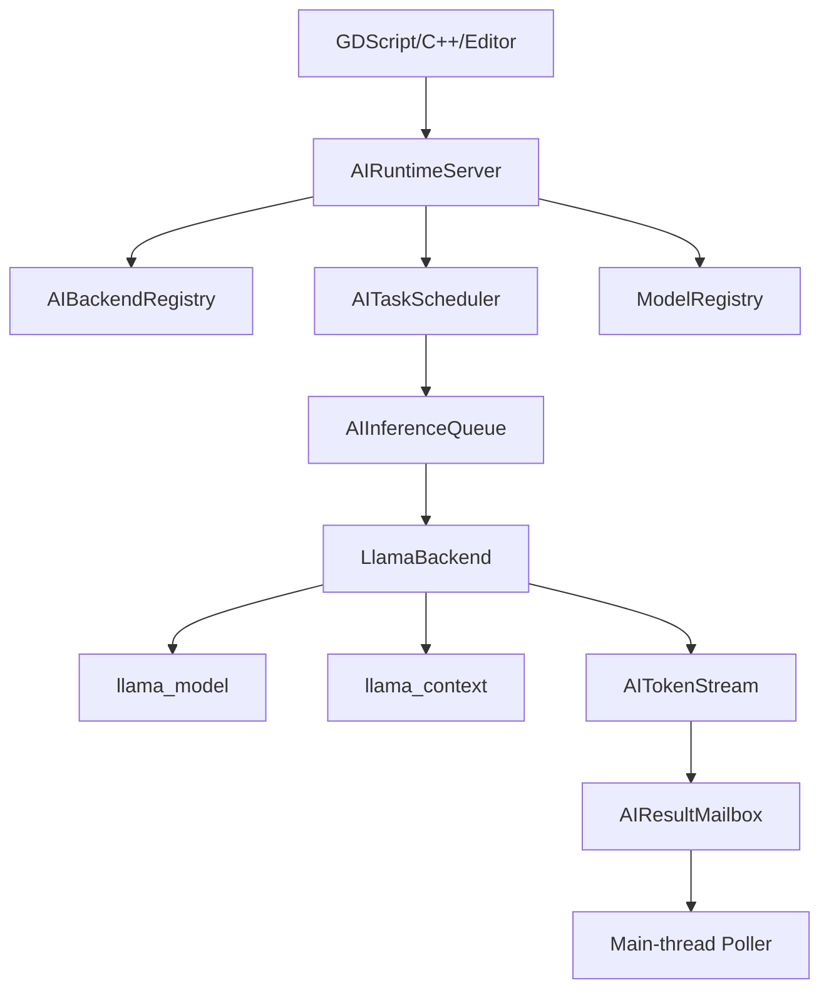
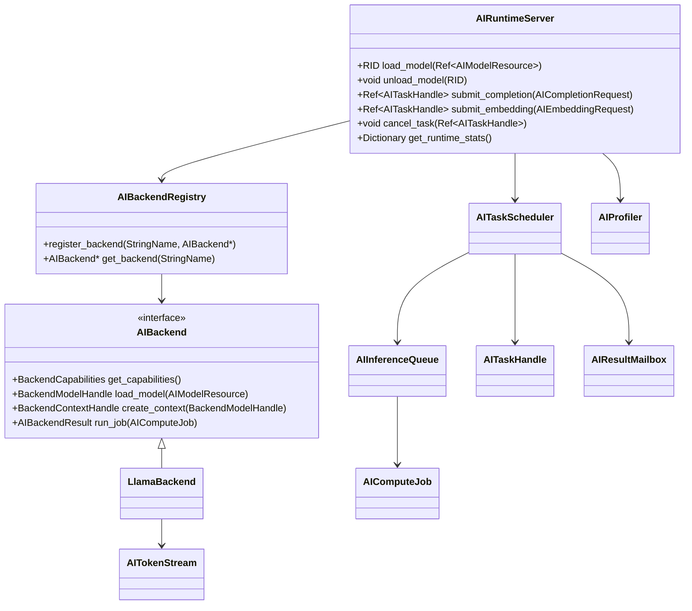
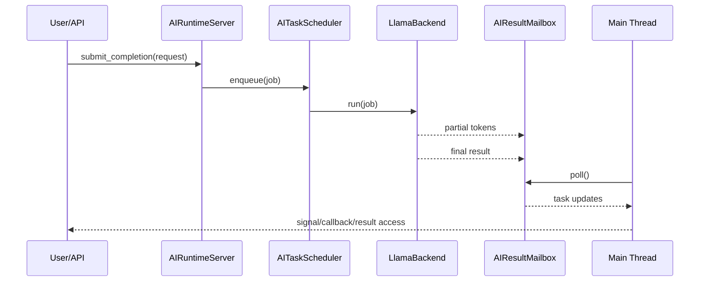
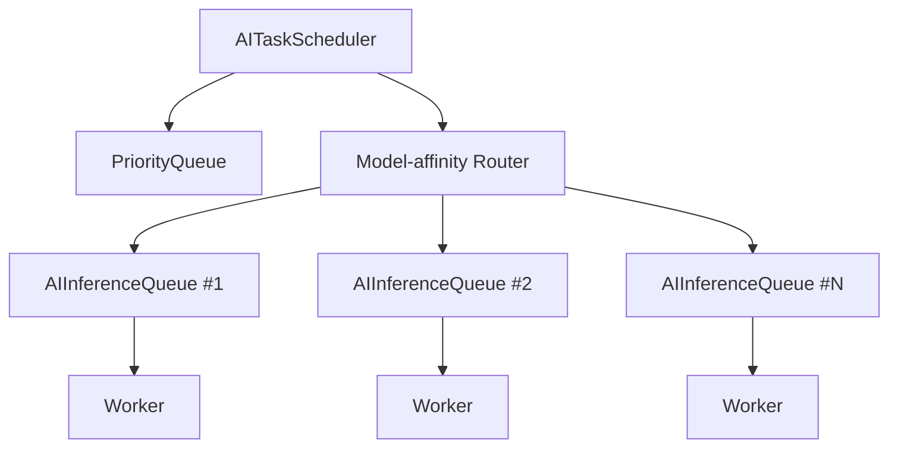
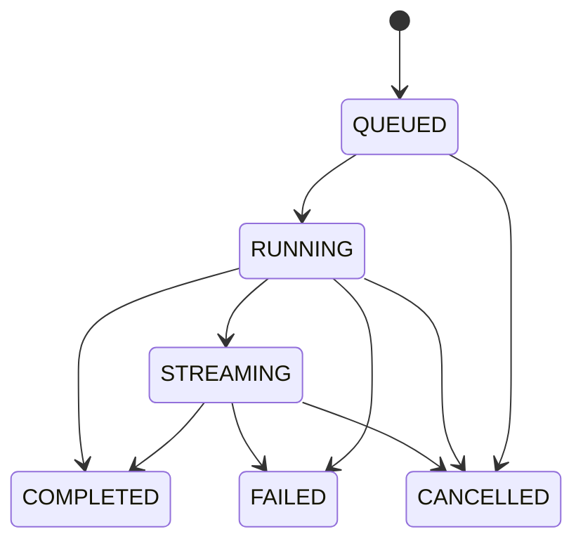
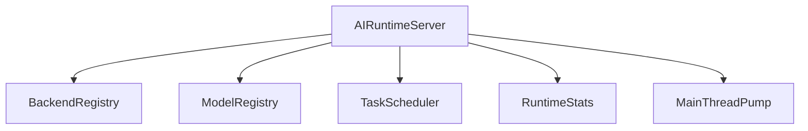
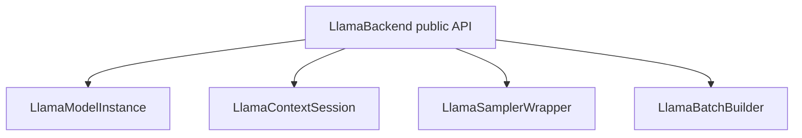

# Woodot AI Runtime Inference

## 1. 模块目标

运行时推理模块负责把 AI 能力变成引擎级可调度服务。

核心要求：

1. 不阻塞主循环
2. 不依赖 Python 环境
3. 可流式输出
4. 可取消、可观测、可回退
5. 不把 `llama.cpp` 语义直接泄漏到 Godot 上层

---

## 2. 运行时总览图



---

## 3. 关键类图



---

## 4. 请求生命周期图



---

## 5. 调度架构

### 5.1 为什么不用通用线程池

LLM 推理具有以下特征：

- 长任务
- 重 CPU / 重内存
- 有状态上下文
- 延迟抖动明显
- 需要流式输出
- 可能存在设备亲和性

这与 Godot 常规短后台任务差异很大，因此必须有独立调度器。

### 5.2 调度层分解



设计建议：

- 按模型实例或设备维度建队列
- 同一 `llama_context` 默认串行 decode
- prefill 与 decode 可以后续拆分优化，但 0 到 1 先保守

---

## 6. 状态机



状态设计要求：

- `QUEUED` 与 `RUNNING` 必须能区分
- `STREAMING` 必须能携带 partial result
- `FAILED` 必须附带机器可读错误码
- `CANCELLED` 必须明确是用户取消还是系统中断

---

## 7. `AIRuntimeServer` 设计细化

### 7.1 责任范围

- 模型注册与句柄管理
- 任务提交入口
- capability 查询
- 性能统计查询
- 主线程 pump 接口

### 7.2 不应该承担的职责

- 不直接操心 UI
- 不直接修改场景树
- 不承担 importer 逻辑
- 不把第三方 backend 细节抛给脚本层

### 7.3 推荐子结构



---

## 8. `LlamaBackend` 设计细化

### 8.1 推荐封装层次



### 8.2 封装理由

- `llama_model` 生命周期与 `llama_context` 不同
- 采样器和 batch builder 可能后续替换
- 会话级对象更适合与任务调度器绑定

### 8.3 高风险点

- 多任务争用同一 context
- 取消任务时 context 清理不干净
- token 流输出频率过高
- 模型卸载和任务执行并发冲突

防御策略：

- `RID` 到运行态实例映射用读写锁保护
- 模型卸载前检查活动任务计数
- partial result 做 chunked flush
- context 会话对象显式状态化

---

## 9. 数据结构建议

### 9.1 `AICompletionRequest`

字段建议：

- `RID model_rid`
- `String prompt`
- `int max_tokens`
- `float temperature`
- `float top_p`
- `int top_k`
- `bool stream`
- `int timeout_ms`
- `String caller_tag`

### 9.2 `AIEmbeddingRequest`

字段建议：

- `RID model_rid`
- `PackedStringArray inputs`
- `bool normalize`
- `int timeout_ms`

### 9.3 `AIBackendResult`

字段建议：

- `Error code`
- `String message`
- `PackedStringArray partial_tokens`
- `String final_text`
- `PackedFloat32Array embedding`
- `uint64_t queue_wait_us`
- `uint64_t exec_time_us`

---

## 10. 主线程回收策略

```mermaid
flowchart TD
    A[Worker pushes update] --> B[Lock-free/MPSC mailbox]
    B --> C[AIRuntimeServer::poll_completed()]
    C --> D[emit signals / update handles]
    D --> E[Editor UI / Scene logic]
```

建议：

- 每帧 poll 次数有限制
- 单帧最多处理固定数量 token chunk
- 若结果过多则分帧投递

防御意义：

- 防止单帧被 AI 结果淹没
- 防止 UI 因大批量 flush 造成长卡顿

---

## 11. 性能治理

### 11.1 关键指标

| 指标 | 目标 |
|---|---|
| 模型热加载 | `< 1.0s` |
| CPU 首 token 延迟 | `< 800ms` |
| GPU 首 token 延迟 | `< 300ms` |
| 任务取消响应 | `< 50ms` |
| 持续推理下帧时间 P99 增量 | `<= 2ms` |

### 11.2 Profiling 维度

- queue wait
- model load
- context create
- prefill
- decode
- mailbox flush
- main-thread apply

### 11.3 观测接口

- `get_runtime_stats()`
- per-task stats
- optional debug panel
- profiler category integration

---

## 12. 潜在问题与防御

| 问题 | 后果 | 防御 |
|---|---|---|
| 模型加载在主线程 | 编辑器卡死 | 强制异步加载 |
| context 共享过度 | 输出串扰、崩溃 | 队列按实例隔离 |
| 每 token 触发 UI 更新 | 消息风暴 | chunk flush |
| 卸载与任务并发 | use-after-free | 活动引用计数和安全屏障 |
| GPU 初始化失败 | 功能不可用 | 能力检测后回退 CPU |
| 任务无限排队 | 长尾卡死 | 超时、优先级、背压 |

---

## 13. 开发工作清单任务表

| 编号 | 任务 | 输出物 | 前置条件 | 风险等级 |
|---|---|---|---|---|
| RT-001 | 定义 `AIBackend` 抽象 | 头文件与接口文档 | BLD-004 | 高 |
| RT-002 | 实现 `LlamaBackend` 最小封装 | 后端骨架 | RT-001 | 高 |
| RT-003 | 实现 `AIRuntimeServer` | 服务入口 | RT-001 | 高 |
| RT-004 | 实现 `AITaskHandle` 状态机 | 句柄对象 | RT-003 | 中 |
| RT-005 | 实现 `AIComputeJob` 与请求结构 | 请求模型 | RT-003 | 中 |
| RT-006 | 实现 `AITaskScheduler` | 调度器骨架 | RT-003 | 高 |
| RT-007 | 实现 `AIInferenceQueue` | 队列与路由 | RT-006 | 高 |
| RT-008 | 实现 `AIResultMailbox` | 主线程回收 | RT-006 | 高 |
| RT-009 | 实现流式 token 聚合 | `AITokenStream` | RT-002 | 中 |
| RT-010 | 接入 profiling | 指标输出 | RT-003 | 中 |
| RT-011 | 验证取消与超时 | 测试用例 | RT-006 | 高 |
| RT-012 | 验证长时稳定性 | 压测报告 | RT-008 | 高 |

---

## 13.1 `RT-001` 落地文件

- 头文件：`modules/woodot_ai/runtime/ai_backend.h`
- 接口文档：`dev-doc/woodot-ai/02-runtime-inference-ai_backend.md`

---

## 13.2 `RT-002` 落地文件

- 头文件：`modules/woodot_ai/backends/llama/llama_backend.h`
- 实现：`modules/woodot_ai/backends/llama/llama_backend.cpp`
- 说明文档：`dev-doc/woodot-ai/02-runtime-inference-llama_backend.md`

---

## 13.3 `RT-003` 落地文件

- 资源类型：`modules/woodot_ai/resources/ai_model_resource.h`
- registry：`modules/woodot_ai/runtime/ai_backend_registry.h`
- 服务入口：`modules/woodot_ai/runtime/ai_runtime_server.h`
- 实现：`modules/woodot_ai/runtime/ai_runtime_server.cpp`
- 说明文档：`dev-doc/woodot-ai/02-runtime-inference-ai_runtime_server.md`

---

## 13.4 `RT-004` 落地文件

- 句柄类型：`modules/woodot_ai/runtime/ai_task_handle.h`
- 实现：`modules/woodot_ai/runtime/ai_task_handle.cpp`
- 说明文档：`dev-doc/woodot-ai/02-runtime-inference-ai_task_handle.md`

---

## 13.5 `RT-005` 落地文件

- 请求类型：`modules/woodot_ai/runtime/ai_requests.h`
- 实现：`modules/woodot_ai/runtime/ai_requests.cpp`
- 执行模型补充：`modules/woodot_ai/runtime/ai_backend.h`
- 说明文档：`dev-doc/woodot-ai/02-runtime-inference-ai_requests.md`

---

## 13.6 `RT-006` 落地文件

- 调度器：`modules/woodot_ai/runtime/ai_task_scheduler.h`
- 实现：`modules/woodot_ai/runtime/ai_task_scheduler.cpp`
- server 接入：`modules/woodot_ai/runtime/ai_runtime_server.h`
- server 实现接入：`modules/woodot_ai/runtime/ai_runtime_server.cpp`
- 说明文档：`dev-doc/woodot-ai/02-runtime-inference-ai_task_scheduler.md`

---

## 13.7 `RT-007` 落地文件

- 推理队列：`modules/woodot_ai/runtime/ai_inference_queue.h`
- 实现：`modules/woodot_ai/runtime/ai_inference_queue.cpp`
- 调度器接入：`modules/woodot_ai/runtime/ai_task_scheduler.h`
- 调度器实现接入：`modules/woodot_ai/runtime/ai_task_scheduler.cpp`
- 说明文档：`dev-doc/woodot-ai/02-runtime-inference-ai_inference_queue.md`

---

## 13.8 `RT-008` 落地文件

- 回收邮箱：`modules/woodot_ai/runtime/ai_result_mailbox.h`
- 实现：`modules/woodot_ai/runtime/ai_result_mailbox.cpp`
- server 回收入口：`modules/woodot_ai/runtime/ai_runtime_server.cpp`
- 调度器接入：`modules/woodot_ai/runtime/ai_task_scheduler.h`
- 调度器实现接入：`modules/woodot_ai/runtime/ai_task_scheduler.cpp`
- 说明文档：`dev-doc/woodot-ai/02-runtime-inference-ai_result_mailbox.md`

---

## 13.9 `RT-009` 落地文件

- token 聚合器：`modules/woodot_ai/runtime/ai_token_stream.h`
- 实现：`modules/woodot_ai/runtime/ai_token_stream.cpp`
- 调度器接入：`modules/woodot_ai/runtime/ai_task_scheduler.h`
- 调度器实现接入：`modules/woodot_ai/runtime/ai_task_scheduler.cpp`
- llama backend 接入：`modules/woodot_ai/backends/llama/llama_backend.cpp`
- 说明文档：`dev-doc/woodot-ai/02-runtime-inference-ai_token_stream.md`

---

## 13.10 `RT-010` 落地文件

- profiling：`modules/woodot_ai/runtime/ai_runtime_profiler.h`
- 实现：`modules/woodot_ai/runtime/ai_runtime_profiler.cpp`
- 调度器接入：`modules/woodot_ai/runtime/ai_task_scheduler.h`
- 调度器实现接入：`modules/woodot_ai/runtime/ai_task_scheduler.cpp`
- runtime stats 出口：`modules/woodot_ai/runtime/ai_runtime_server.cpp`
- 说明文档：`dev-doc/woodot-ai/02-runtime-inference-ai_runtime_profiler.md`

---

## 14. 验收标准

1. 异步 completion 路径完整可用
2. embedding 路径完整可用
3. 流式输出不阻塞主循环
4. 主线程回收符合线程安全约束
5. 有可读的错误码、取消和统计接口
