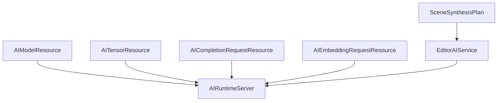
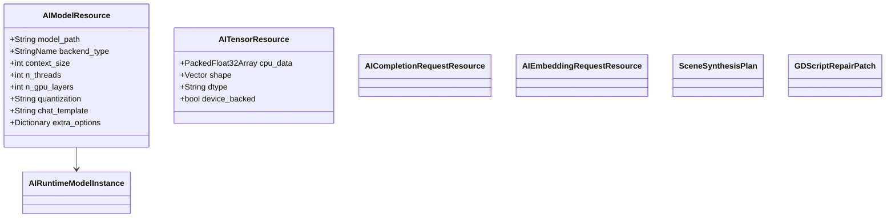
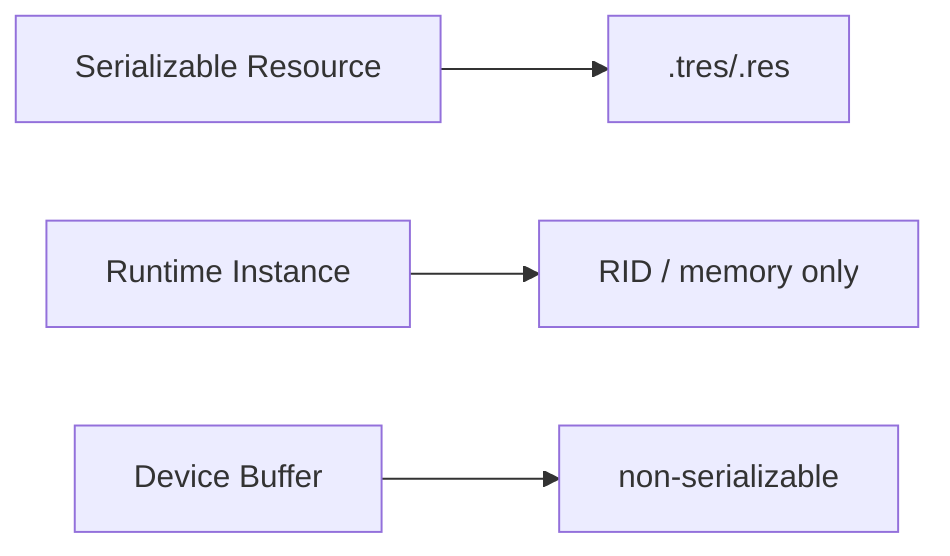
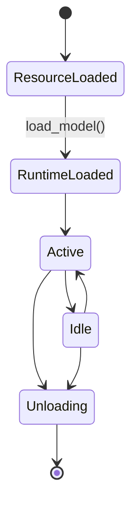
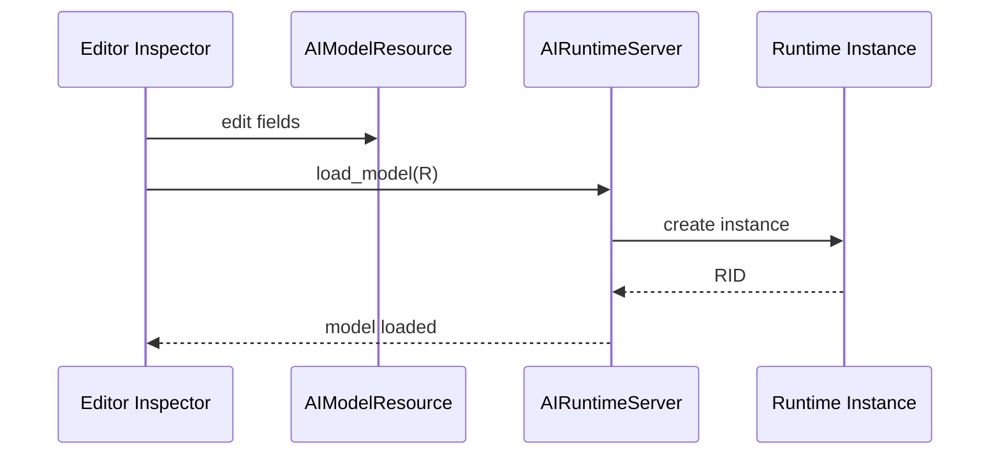

# Woodot AI Resource Model

## 1. 模块目标

本模块负责把 AI 运行所需的静态描述、输入输出和中间计划抽象为 Godot 资源对象，同时与真实运行态实例解耦。

核心原则：

1. `Resource` 只描述，不直接等于运行态实例
2. 资源必须可序列化、可检查、可编辑
3. 运行态对象必须由 `AIRuntimeServer` 持有
4. CPU 内存与设备内存必须显式区分

---

## 2. 资源体系图



---

## 3. 类图



---

## 4. 资源与运行态实例分离图

```mermaid
flowchart LR
    A[AIModelResource] --> B[load_model()]
    B --> C[RID]
    C --> D[AIRuntimeModelInstance]
    D --> E[BackendModelHandle]
    D --> F[ContextPool]
```

分离理由：

- `Resource` 可能长期存在于编辑器与场景文件中
- 运行态实例可能很大、很重、很短命
- 同一个 `AIModelResource` 可能对应多个运行态实例或多个设备映射

---

## 5. 建议资源列表

### 5.1 `AIModelResource`

用途：

- 描述模型位置和加载参数
- 供编辑器面板和脚本引用
- 作为构建与导出时的模型元信息来源

字段建议：

- `model_path`
- `backend_type`
- `context_size`
- `n_threads`
- `n_gpu_layers`
- `quantization`
- `chat_template`
- `rope_scaling`
- `system_prompt_template`
- `capability_tags`

### 5.2 `AITensorResource`

用途：

- 封装 embedding、张量输入、张量输出
- 为未来非 LLM 任务预留统一张量容器

字段建议：

- `shape`
- `dtype`
- `storage_type`
- `cpu_data`
- `metadata`

### 5.3 `AICompletionRequestResource`

用途：

- 序列化 completion 默认参数
- 便于场景内复用请求模板

### 5.4 `AIEmbeddingRequestResource`

用途：

- 批量 embedding 请求模板

### 5.5 `SceneSynthesisPlan`

用途：

- 自然语言到 Node 树生成的结构化中间层

### 5.6 `GDScriptRepairPatch`

用途：

- 表示 AI 修复给出的 patch 建议
- 支持 diff 预览和回滚

---

## 6. 序列化边界图



边界要求：

- `.tres/.res` 中不允许存真实 `llama_context`
- 设备句柄、线程对象、内存映射对象都不能进 Resource
- 如果需要缓存运行态信息，只能存可恢复的元数据

---

## 7. 生命周期图



注意：

- `ResourceLoaded` 不代表模型已进内存
- `RuntimeLoaded` 才代表后端实例可用
- 卸载时必须保证没有活动任务

---

## 8. 内存所有权规则

### 8.1 CPU 数据

- 可由 `PackedFloat32Array` 等 Godot 容器持有
- 允许序列化的只应是明确需要持久化的数据

### 8.2 设备数据

- 必须由运行态对象持有
- `AITensorResource` 只能持一个受控标识或镜像数据

### 8.3 大对象防御

- 不允许在 Inspector 中直接复制超大张量
- 大 embedding 集合优先走 sidecar 文件或缓存索引

---

## 9. 风险与防御

| 风险 | 后果 | 防御 |
|---|---|---|
| Resource 持有运行时对象 | 序列化崩坏、析构混乱 | 严格分离 Resource 与 Runtime |
| 张量隐式复制 | 内存暴涨 | 显式 copy policy |
| 设备缓冲误序列化 | 资源损坏 | 序列化白名单字段 |
| 模型参数变更不触发重载 | 结果不一致 | 参数指纹与 dirty 标记 |
| 编辑器面板直接读大对象 | 卡死 | 预览数据限制和分页 |

---

## 10. 与编辑器和运行时的协作图



---

## 11. 开发工作清单任务表

| 编号 | 任务 | 输出物 | 前置条件 | 风险等级 |
|---|---|---|---|---|
| RES-001 | 定义 `AIModelResource` | 资源类 | RT-001 | 高 |
| RES-002 | 定义 `AITensorResource` | 资源类 | RT-001 | 高 |
| RES-003 | 定义请求模板资源 | 请求资源类 | RES-001 | 中 |
| RES-004 | 定义 `SceneSynthesisPlan` | 结构化计划资源 | ED-001 | 中 |
| RES-005 | 定义 `GDScriptRepairPatch` | patch 资源 | ED-001 | 中 |
| RES-006 | 建立资源序列化测试 | 测试用例 | RES-001 | 高 |
| RES-007 | 建立参数指纹与 dirty 检测 | 校验逻辑 | RES-001 | 中 |
| RES-008 | 建立大对象显示限制 | Inspector 策略 | RES-002 | 中 |

---

## 11.1 `RES-001` 落地文件

- 资源类：`modules/woodot_ai/resources/ai_model_resource.h`
- 实现：`modules/woodot_ai/resources/ai_model_resource.cpp`
- 注册：`modules/woodot_ai/register_types.cpp`
- 说明文档：`dev-doc/woodot-ai/03-resource-model-ai_model_resource.md`

---

## 11.2 `RES-002` 落地文件

- 资源类：`modules/woodot_ai/resources/ai_tensor_resource.h`
- 实现：`modules/woodot_ai/resources/ai_tensor_resource.cpp`
- 注册：`modules/woodot_ai/register_types.cpp`
- 说明文档：`dev-doc/woodot-ai/03-resource-model-ai_tensor_resource.md`

---

## 12. 验收标准

1. 资源对象与运行态实例完全解耦
2. 序列化字段清晰、可测
3. 大对象不会因 Inspector 或保存流程导致卡死
4. 编辑器与运行时都能稳定复用资源对象
