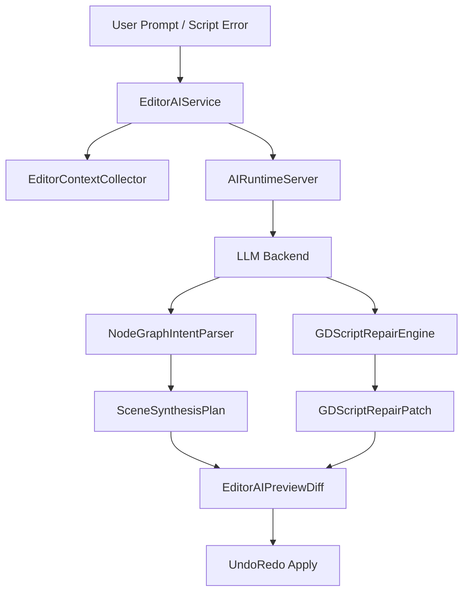
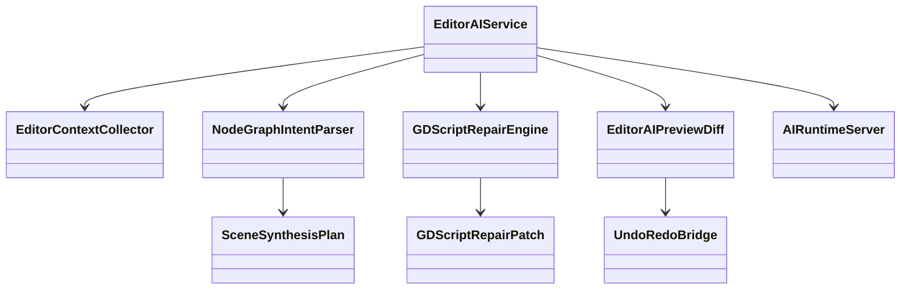
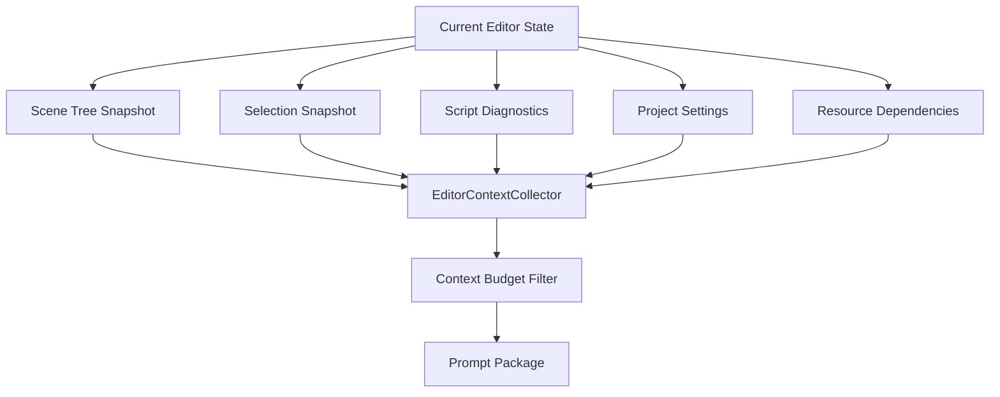
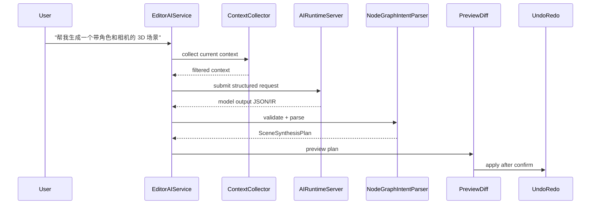
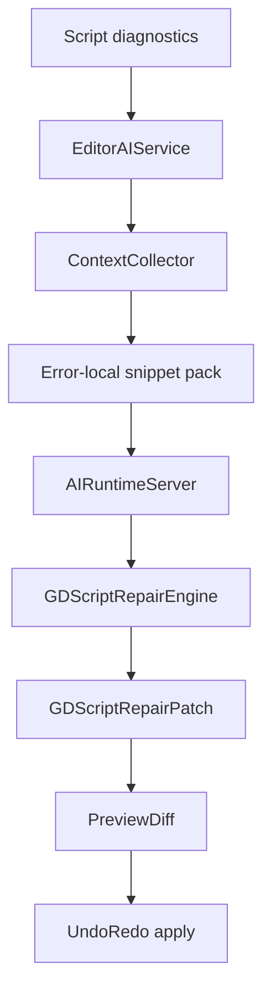

# Woodot AI Editor Synergy

## 1. 模块目标

本模块负责把底层 AI 能力转化为可控的编辑器生产力。

核心目标：

1. 自然语言生成 Node 树
2. GDScript 智能修复
3. 项目上下文感知协同
4. 全流程预览、确认、撤销

这里的关键词不是“智能”，而是“可控”。

---

## 2. 编辑器协同总览图

---

## 3. 类图

---

## 4. 上下文采集架构图

设计要求：

- 上下文采集必须限量
- 优先收敛局部上下文，不扫全仓
- 可缓存稳定上下文，减少重复拼装成本

---

## 5. 自然语言生成 Node 树流程

关键要求：

- LLM 输出必须是 JSON/IR，而不是自由文本命令
- parser 必须做 schema 校验、类型校验、节点白名单校验
- 落地前必须显示预览

---

## 6. GDScript 修复流程

修复策略建议：

- 优先针对 parser error 和 symbol error
- 只发局部代码片段和相关上下文
- 输出 patch，而不是完整文件重写

---

## 7. 预览与撤销图

防御原则：

- 所有自动修改必须 `UndoRedo` 化
- 不允许绕过编辑器既有事务机制
- 多文件 patch 必须作为一个可回滚事务或一组有序事务

---

## 8. 编辑器侧风险

| 风险 | 后果 | 防御 |
|---|---|---|
| 模型输出自由文本命令 | 脏场景、非法操作 | 强制 JSON/IR |
| 无上下文预算 | 响应慢且成本高 | 上下文限额与缓存 |
| 同步等待模型 | 编辑器卡顿 | 全异步请求 |
| 自动应用 patch | 错误改写 | 预览 + 人工确认 |
| 未接入 UndoRedo | 无法回滚 | 统一桥接层 |
| 生成非法节点类型 | 场景损坏 | 节点白名单和 ClassDB 校验 |

---

## 9. `EditorAIService` 设计细化

职责：

- 统一入口
- 协调上下文收集
- 调用运行时
- 控制模型输出格式
- 驱动 preview 和 apply

不应承担：

- 底层推理调度
- 直接改写 Node 树
- 持久缓存所有项目语义索引细节

---

## 10. `NodeGraphIntentParser` 防御设计

### 输入

- JSON/IR 文本
- 当前工程支持的节点和资源信息

### 输出

- `SceneSynthesisPlan`
- 校验错误信息
- 风险警告

### 校验层级

1. JSON 结构合法
2. schema 合法
3. 节点类型存在
4. 属性存在且类型兼容
5. 资源路径存在或可创建
6. 不触碰禁区节点或编辑器保留对象

---

## 11. 开发工作清单任务表

| 编号 | 任务 | 输出物 | 前置条件 | 风险等级 |
|---|---|---|---|---|
| ED-001 | 实现 `EditorAIService` 骨架 | 服务入口 | RT-003 | 高 |
| ED-002 | 实现 `EditorContextCollector` | 上下文采集 | ED-001 | 高 |
| ED-003 | 设计上下文 budget 策略 | 预算规则 | ED-002 | 中 |
| ED-004 | 实现 `NodeGraphIntentParser` | JSON/IR 解析器 | RES-004 | 高 |
| ED-005 | 实现 `GDScriptRepairEngine` | 修复引擎 | RES-005 | 高 |
| ED-006 | 实现 `EditorAIPreviewDiff` | diff 预览 UI | ED-001 | 高 |
| ED-007 | 接入 `UndoRedo` 桥接 | 可撤销应用层 | ED-006 | 高 |
| ED-008 | 完成 Node 树生成 MVP | 端到端功能 | ED-004 | 高 |
| ED-009 | 完成脚本修复 MVP | 端到端功能 | ED-005 | 高 |
| ED-010 | 编写非法输出防御测试 | 测试用例 | ED-004 | 高 |

---

## 12. 验收标准

1. 所有 AI 改动都可预览
2. 所有 AI 改动都可撤销
3. Node 树生成功能不允许绕过 schema 校验
4. GDScript 修复不以整文件覆写为默认路径
5. 编辑器 AI 请求全异步，不阻塞主交互
