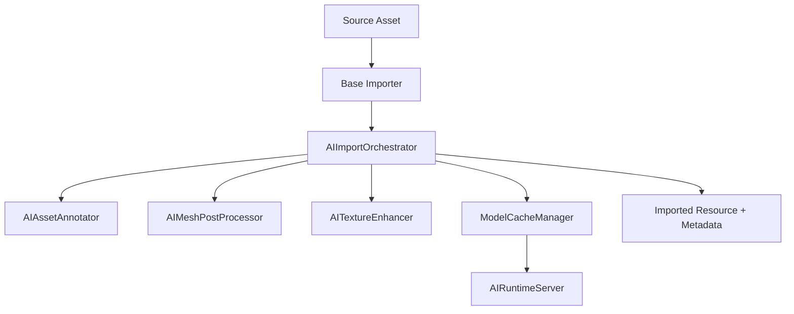
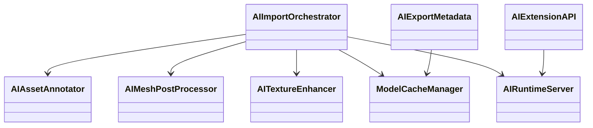
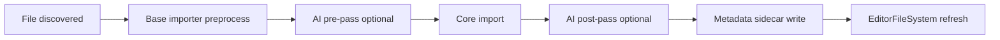
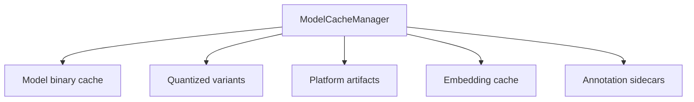
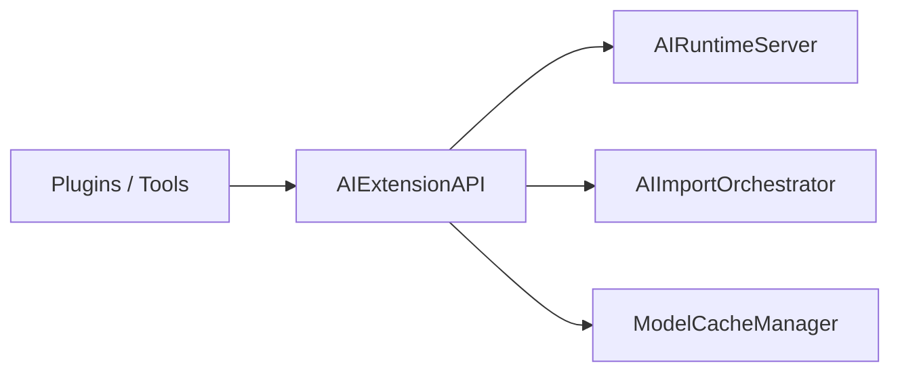
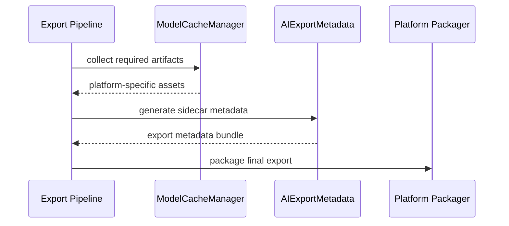

# Woodot AI Import Pipeline And Ecosystem

## 1. 模块目标

本模块负责在资源导入、导出、缓存和生态扩展层面建立 AI 工作流基础设施。

核心目标：

1. 在 Importer 前后插入 AI pass
2. 建立模型缓存和平台工件管理
3. 支持自动标注、网格后处理、贴图增强
4. 为未来插件与多后端演进提供稳定 API

---

## 2. 资源管线总览图

---

## 3. 类图

---

## 4. Importer 插入点图

建议：

- AI pass 默认关闭
- AI pass 逐项可开关
- AI pass 失败不能阻塞基础导入

---

## 5. 缓存与工件管理图

缓存原则：

- 可重建的缓存与源码资产分离
- 平台工件按平台和 ABI 维度切分
- 导出时仅带必要工件，不把所有开发期缓存打包进去

---

## 6. 生态 API 图

设计目标：

- 插件依赖 `AIExtensionAPI`
- 插件不直接依赖 `LlamaBackend`
- 后续替换后端时尽量不破坏生态

---

## 7. 导出链路图

---

## 8. 高风险点与防御

| 风险 | 后果 | 防御 |
|---|---|---|
| AI pass 太重 | 导入变慢 | 默认关闭、逐项启用、异步预处理 |
| Importer 失败导致整个导入失败 | 破坏编辑器可用性 | AI pass 失败回退基础导入 |
| 缓存污染 | 结果不一致 | 缓存 key 包含模型参数与版本指纹 |
| 导出带入冗余模型工件 | 包体暴涨 | 平台工件白名单 |
| 生态绑死特定后端 | 难以替换 | 稳定 API 抽象 |

---

## 9. 模块职责细化

### 9.1 `AIImportOrchestrator`

职责：

- 判断哪些资源应用 AI pass
- 调度导入期推理任务
- 聚合标注、增强、缓存写回

实现说明：

- 参考 `05-import-pipeline-ecosystem-ai_import_orchestrator.md`

### 9.2 `AIAssetAnnotator`

职责：

- 为资源打标签
- 生成文本描述
- 生成检索关键词

### 9.3 `AIMeshPostProcessor`

职责：

- 自动拓扑建议
- 网格分类
- LOD 分析建议

### 9.4 `AITextureEnhancer`

职责：

- 超分
- 去噪
- 法线/粗糙度辅助生成

### 9.5 `ModelCacheManager`

职责：

- 模型缓存
- 平台工件缓存
- 量化版本缓存
- embedding 缓存

---

## 10. 开发工作清单任务表

| 编号 | 任务 | 输出物 | 前置条件 | 风险等级 |
|---|---|---|---|---|
| PIPE-001 | 实现 `AIImportOrchestrator` 骨架 | 导入编排入口 | RT-003 | 高 |
| PIPE-002 | 定义 AI pass 开关策略 | 项目设置与默认值 | PIPE-001 | 中 |
| PIPE-003 | 实现 `AIAssetAnnotator` MVP | 标注器 | PIPE-001 | 中 |
| PIPE-004 | 实现 `AIMeshPostProcessor` 设计稿 | 方案文档/骨架 | PIPE-001 | 中 |
| PIPE-005 | 实现 `AITextureEnhancer` 设计稿 | 方案文档/骨架 | PIPE-001 | 中 |
| PIPE-006 | 实现 `ModelCacheManager` | 缓存管理 | BLD-006 | 高 |
| PIPE-007 | 设计导出工件白名单 | 导出策略 | PIPE-006 | 高 |
| PIPE-008 | 实现 `AIExtensionAPI` | 扩展接口 | RT-003 | 高 |
| PIPE-009 | 失败回退验证 | 测试用例 | PIPE-001 | 高 |
| PIPE-010 | 导入性能压测 | 性能报告 | PIPE-003 | 高 |

---

## 11. 验收标准

1. AI pass 默认关闭且不会影响基础导入
2. 导入失败可以安全回退
3. 缓存命中率和失效机制可观测
4. 插件可以只依赖稳定 API 层
5. 导出不会无控制地打入冗余 AI 工件
